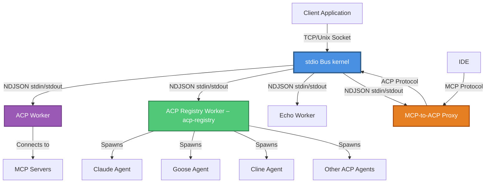

# stdio Bus – Worker Registry

[](https://www.npmjs.com/package/@stdiobus/workers-registry)
[](https://github.com/stdiobus/workers-registry/blob/main/LICENSE)
[](https://nodejs.org)
[](https://www.npmjs.com/package/@stdiobus/workers-registry)

Worker implementations for [stdio Bus kernel](https://github.com/stdiobus/stdiobus) - a high-performance message routing daemon for agent protocols.

**Features:**
- Full ACP (Agent Client Protocol) implementation
- MCP (Model Context Protocol) server integration
- Protocol bridges (MCP ↔ ACP)
- TypeScript support with full type definitions
- High-performance NDJSON protocol
- Docker-ready

## Installation

```bash
npm install @stdiobus/workers-registry
```

**Requirements:**
- Node.js ≥20.0.0
- [stdio Bus kernel](https://github.com/stdiobus/stdiobus) (Docker or binary)

**Keywords:** `stdiobus`, `protocol`, `acp`, `mcp`, `agent`, `transport`, `json-rpc`, `stdio-bus`, `worker`

---

## Overview

stdio Bus kernel provides the core protocol and message routing infrastructure. This package contains the worker implementations that run as child processes of stdio Bus kernel, handling various agent protocols and use cases.

## Architecture



## Prerequisites

- stdio Bus kernel - available via [Docker](https://hub.docker.com/r/stdiobus/stdiobus) or [build from source](https://github.com/stdiobus/stdiobus)
- Node.js 20.0.0 or later (for building workers)

## Workers

| Worker | Description | Protocol | Command |
|--------|-------------|----------|---------|
| `acp-registry` | Registry Launcher worker that routes to ACP Registry agents (requires `api-keys.json`) | ACP | `node ./node_modules/@stdiobus/workers-registry/launch acp-registry` |
| `acp-worker` | Full ACP protocol implementation (standalone agent; does **not** route to ACP Registry) | ACP | `node ./node_modules/@stdiobus/workers-registry/launch acp-worker` |
| `registry-launcher` | Registry Launcher implementation module used by `acp-registry` (not a launch target) | ACP | Use `acp-registry` |
| `mcp-to-acp-proxy` | Bridges MCP clients (like IDEs) to ACP agents | MCP → ACP | `node ./node_modules/@stdiobus/workers-registry/launch mcp-to-acp-proxy` |
| `echo-worker` | Simple echo worker for testing NDJSON protocol | NDJSON | `node ./node_modules/@stdiobus/workers-registry/launch echo-worker` |
| `mcp-echo-server` | MCP server example for testing | MCP | `node ./node_modules/@stdiobus/workers-registry/launch mcp-echo-server` |

**Note:** The universal launcher is `@stdiobus/workers-registry/launch`. In this repo, use
`node ./launch/index.js <worker-name>` after `npm run build`.

## Package API

### Module Imports

```javascript
// Import ACP worker (default export)
import worker from '@stdiobus/workers-registry';

// Import specific workers
import acpWorker from '@stdiobus/workers-registry/workers/acp-worker';
import echoWorker from '@stdiobus/workers-registry/workers/echo-worker';
import mcpEchoServer from '@stdiobus/workers-registry/workers/mcp-echo-server';
import mcpToAcpProxy from '@stdiobus/workers-registry/workers/mcp-to-acp-proxy';

// Import workers metadata
import { workers } from '@stdiobus/workers-registry/workers';
console.log(workers['acp-worker'].entrypoint);
```

**Note:** `acp-registry` is a worker runtime launched via
`@stdiobus/workers-registry/launch` and is not exported as a module.

### TypeScript Support

Full TypeScript definitions are included:

```typescript
import type { ACPAgent } from '@stdiobus/workers-registry/workers/acp-worker';
import type { MCPServer } from '@stdiobus/workers-registry/workers/mcp-echo-server';
```

## Quick Start

### 1. Install Package

```bash
npm install @stdiobus/workers-registry
```

### 2. Get stdio Bus kernel

**Option A: Using Docker (recommended)**

```bash
docker pull stdiobus/stdiobus:latest
```

**Option B: Build from source**

See [stdio Bus kernel repository](https://github.com/stdiobus/stdiobus) for build instructions.

### 3. Run with ACP Registry (recommended for real agents)

**Create config.json:**
```json
{
  "pools": [
    {
      "id": "acp-registry",
      "command": "node",
      "args": [
        "@stdiobus/workers-registry",
        "acp-registry"
      ],
      "instances": 1
    }
  ]
}
```

**Important:** Place `api-keys.json` next to your stdio Bus config (working directory),
or pass a custom config file (third arg to `launch acp-registry`) with an absolute
`apiKeysPath`. In this repo, the default file is
`workers-registry/acp-registry/acp-registry-config.json`.
Use the same Docker/binary commands below (they run `config.json`), and ensure
`api-keys.json` is mounted into the container when using Docker.

### 4. Run with ACP Worker

**Note:** `acp-worker` is a standalone ACP agent for SDK/protocol testing. It does **not**
route to the ACP Registry. Use `acp-registry` when you need real registry agents.

**Create config.json:**
```json
{
  "pools": [
    {
      "id": "acp-worker",
      "command": "node",
      "args": [
        "@stdiobus/workers-registry",
        "acp-worker"
      ],
      "instances": 1
    }
  ]
}
```

**Run with Docker:**
```bash
docker run -p 9000:9000 \
  -v $(pwd):/stdiobus:ro \
  -v $(pwd)/config.json:/config.json:ro \
  stdiobus/stdiobus:latest \
  --config /config.json --tcp 0.0.0.0:9000
```

**Or with binary:**
```bash
./stdio_bus --config config.json --tcp 0.0.0.0:9000
```

### 5. Test Connection

```bash
# ACP worker (standalone)
echo '{"jsonrpc":"2.0","id":"1","method":"initialize","params":{"clientInfo":{"name":"test","version":"1.0"}}}' | nc localhost 9000

# ACP Registry worker (route to a registry agent)
echo '{"jsonrpc":"2.0","id":"1","method":"initialize","params":{"agentId":"claude-acp","clientInfo":{"name":"test","version":"1.0"}}}' | nc localhost 9000
```

---

## Usage Examples

### Using the Universal Launcher

The simplest way to run any worker:

```bash
# Run any worker by name (package install)
node ./node_modules/@stdiobus/workers-registry/launch <worker-name>

# Run any worker by name (this repo, after build)
node ./launch/index.js <worker-name>

# Available workers:
# - acp-registry
# - acp-worker
# - echo-worker
# - mcp-echo-server
# - mcp-to-acp-proxy

# Example: Run echo worker for testing
node ./node_modules/@stdiobus/workers-registry/launch echo-worker
```

### Using in stdio Bus Configuration

**Basic ACP Worker:**
```json
{
  "pools": [{
    "id": "acp-worker",
    "command": "node",
    "args": [
      "@stdiobus/workers-registry",
      "acp-worker"
    ],
    "instances": 1
  }]
}
```

**ACP Registry Worker with API Keys:**
```json
{
  "pools": [
    {
      "id": "acp-registry",
      "command": "node",
      "args": [
        "@stdiobus/workers-registry",
        "acp-registry"
      ],
      "instances": 1
    }
  ]
}
```
**Note:** `acp-registry` reads `api-keys.json` via its config. The default
`apiKeysPath` is `./api-keys.json`. You can pass a custom config file as the third
arg to `launch acp-registry`.

**Multiple Workers:**
```json
{
  "pools": [
    {
      "id": "acp-worker",
      "command": "node",
      "args": [
        "@stdiobus/workers-registry",
        "acp-worker"
      ],
      "instances": 2
    },
    {
      "id": "echo-worker",
      "command": "node",
      "args": [
        "@stdiobus/workers-registry",
        "echo-worker"
      ],
      "instances": 1
    }
  ]
}
```

### Using with Kiro IDE (MCP Client)

Configure MCP-to-ACP Proxy in Kiro's MCP settings:

```json
{
  "mcpServers": {
    "stdio-bus-acp": {
      "command": "node",
      "args": [
        "./node_modules/@stdiobus/workers-registry/launch",
        "mcp-to-acp-proxy"
      ],
      "env": {
        "ACP_HOST": "localhost",
        "ACP_PORT": "9000",
        "AGENT_ID": "claude-acp"
      }
    }
  }
}
```

**Note:** Run `acp-registry` on the stdio Bus side so `AGENT_ID` resolves to real
ACP Registry agents. `acp-worker` is a standalone agent and will not route to the registry.

---

## Worker Documentation

### ACP Worker

Full implementation of the Agent Client Protocol using the official `@agentclientprotocol/sdk`.

**Location:** `workers-registry/acp-worker/`

**Features:**
- Complete ACP protocol support (initialize, session management, prompts)
- MCP server integration for tool execution
- Session-based routing
- Graceful shutdown handling

**Build:**
```bash
cd workers-registry/acp-worker
npm install
npm run build
```

**Run with stdio Bus:**

Using Docker:
```bash
docker run \
  --name stdiobus-acp \
  -p 9000:9000 \
  -v $(pwd):/stdiobus:ro \
  -v $(pwd)/workers-registry/acp-worker/acp-worker-config.json:/config.json:ro \
  stdiobus/stdiobus:latest \
  --config /config.json --tcp 0.0.0.0:9000
```

Using binary:
```bash
./stdio_bus --config workers-registry/acp-worker/acp-worker-config.json --tcp 0.0.0.0:9000
```

**Configuration:** See `workers-registry/acp-worker/src/` for implementation details.

---

### ACP Registry Worker (acp-registry)

Routes messages to any agent in the [ACP Registry](https://cdn.agentclientprotocol.com/registry/v1/latest/registry.json).

**Location (worker entrypoint):** `workers-registry/acp-registry/`

**Implementation:** `workers-registry/acp-worker/src/registry-launcher/`

**Features:**
- Automatic agent discovery from ACP Registry
- Dynamic agent process management
- API key injection from configuration
- Session affinity routing

**Available Agents:**
- `claude-acp` - Claude Agent
- `goose` - Goose
- `cline` - Cline
- `github-copilot` - GitHub Copilot
- And many more from the registry

**Configuration:**
```json
{
  "pools": [
    {
      "id": "acp-registry",
      "command": "node",
      "args": [
        "@stdiobus/workers-registry",
        "acp-registry"
      ],
      "instances": 1
    }
  ]
}
```
**Note:** `acp-registry` uses its default config when no path is provided. You can
pass a custom config file as the third arg to `launch acp-registry`. The default
file in this repo is `workers-registry/acp-registry/acp-registry-config.json`, which
expects `api-keys.json` at `./api-keys.json` unless you override `apiKeysPath`.

**Run:**

Using Docker:
```bash
docker run \
  --name stdiobus-registry \
  -p 9000:9000 \
  -v $(pwd):/stdiobus:ro \
  -v $(pwd)/workers-registry/acp-registry/acp-registry-config.json:/config.json:ro \
  -v $(pwd)/api-keys.json:/api-keys.json:ro \
  stdiobus/stdiobus:latest \
  --config /config.json --tcp 0.0.0.0:9000
```

Using binary:
```bash
./stdio_bus --config workers-registry/acp-registry/acp-registry-config.json --tcp 0.0.0.0:9000
```

---

### MCP-to-ACP Proxy

Bridges MCP clients (like IDE) to ACP agents through stdio Bus.

**Location:** `workers-registry/mcp-to-acp-proxy/`

**Architecture:**
```
IDE (MCP Client) → MCP-to-ACP Proxy → stdio Bus → ACP Registry Worker (acp-registry) → ACP Agent
```

**Configuration for IDE:**
```json
{
  "mcpServers": {
    "stdio-bus-acp": {
      "command": "node",
      "args": [
        "@stdiobus/workers-registry",
        "mcp-to-acp-proxy"
      ],
      "env": {
        "ACP_HOST": "0.0.0.0",
        "ACP_PORT": "9000",
        "AGENT_ID": "claude-acp"
      }
    }
  }
}
```

**Documentation:** See [workers-registry/mcp-to-acp-proxy/README.md](workers-registry/mcp-to-acp-proxy/README.md)

---

### Echo Worker

Simple reference implementation demonstrating the NDJSON worker protocol.

**Location:** `workers-registry/echo-worker/`

**Purpose:**
- Testing stdio Bus kernel functionality
- Reference implementation for custom workers
- Protocol documentation through code

**Run standalone:**
```bash
echo '{"jsonrpc":"2.0","id":"1","method":"test","params":{"foo":"bar"}}' | node workers-registry/echo-worker/echo-worker.js
```

**Run with stdio Bus:**

Using Docker:
```bash
docker run \
  --name stdiobus-echo \
  -p 9000:9000 \
  -v $(pwd):/stdiobus:ro \
  -v $(pwd)/workers-registry/echo-worker/echo-worker-config.json:/config.json:ro \
  stdiobus/stdiobus:latest \
  --config /config.json --tcp 0.0.0.0:9000
```

Using binary:
```bash
./stdio_bus --config workers-registry/echo-worker/echo-worker-config.json --tcp 0.0.0.0:9000
```

---

### MCP Echo Server

TypeScript MCP server example for testing MCP integration.

**Location:** `workers-registry/mcp-echo-server/`

**Tools provided:**
- `echo` - Echoes input text
- `reverse` - Reverses input text
- `uppercase` - Converts to uppercase
- `delay` - Echoes after a delay (for testing cancellation)
- `error` - Always returns an error (for testing error handling)

**Build:**
```bash
cd workers-registry/mcp-echo-server
npm install
npm run build
```

**Run:**
```bash
node workers-registry/mcp-echo-server/dist/index.js
```

---

## stdio Bus Configuration

stdio Bus kernel is configured via JSON files. This repository includes example configurations for each worker.

### Configuration File Structure

```json
{
  "pools": [
    {
      "id": "worker-id",
      "command": "/path/to/executable",
      "args": ["arg1", "arg2"],
      "instances": 1
    }
  ],
  "limits": {
    "max_input_buffer": 1048576,
    "max_output_queue": 4194304,
    "max_restarts": 5,
    "restart_window_sec": 60,
    "drain_timeout_sec": 30,
    "backpressure_timeout_sec": 60
  }
}
```

### Pool Configuration

| Field | Type | Required | Description |
|-------|------|----------|-------------|
| `id` | string | Yes | Unique identifier for this worker pool |
| `command` | string | Yes | Path to the executable |
| `args` | string[] | No | Command-line arguments |
| `instances` | number | Yes | Number of worker instances (≥ 1) |

### Limits Configuration

| Field | Type | Default | Description |
|-------|------|---------|-------------|
| `max_input_buffer` | number | 1048576 (1 MB) | Maximum input buffer size per connection |
| `max_output_queue` | number | 4194304 (4 MB) | Maximum output queue size per connection |
| `max_restarts` | number | 5 | Maximum worker restarts within restart window |
| `restart_window_sec` | number | 60 | Time window for counting restarts |
| `drain_timeout_sec` | number | 30 | Timeout for graceful shutdown |
| `backpressure_timeout_sec` | number | 60 | Timeout before closing connection when queue is full |

### Example Configurations

**Minimal Configuration:**
```json
{
  "pools": [{
    "id": "echo-worker",
    "command": "node",
    "args": [
      "@stdiobus/workers-registry",
      "echo-worker"
    ],
    "instances": 1
  }]
}
```

**High-Throughput Configuration:**
```json
{
  "pools": [
    {
      "id": "acp-worker",
      "command": "node",
      "args": [
        "@stdiobus/workers-registry",
        "acp-worker"
      ],
      "instances": 4
    }
  ],
  "limits": {
    "max_input_buffer": 4194304,
    "max_output_queue": 16777216,
    "backpressure_timeout_sec": 120
  }
}
```

**Multiple Worker Pools:**
```json
{
  "pools": [
    {
      "id": "acp-worker",
      "command": "node",
      "args": [
        "@stdiobus/workers-registry",
        "acp-worker"
      ],
      "instances": 2
    },
    {
      "id": "echo-worker",
      "command": "node",
      "args": [
        "@stdiobus/workers-registry",
        "echo-worker"
      ],
      "instances": 1
    }
  ]
}
```

---

## NDJSON Protocol

Workers communicate with stdio Bus kernel via stdin/stdout using NDJSON (Newline-Delimited JSON).

### Protocol Rules

1. **Input (stdin):** stdio Bus sends JSON-RPC messages, one per line
2. **Output (stdout):** Workers write JSON-RPC responses, one per line
3. **Errors (stderr):** All logging and debug output goes to stderr
4. **Never write non-JSON to stdout** - it will break the protocol

### Message Types

**Request** (requires response):
```json
{"jsonrpc":"2.0","id":"1","method":"test","params":{"foo":"bar"}}
```

**Response:**
```json
{"jsonrpc":"2.0","id":"1","result":{"status":"ok"}}
```

**Notification** (no response):
```json
{"jsonrpc":"2.0","method":"notify","params":{"event":"started"}}
```

### Session Affinity

Messages with the same `sessionId` are routed to the same worker instance:

```json
{"jsonrpc":"2.0","id":"1","method":"test","sessionId":"sess-123","params":{}}
```

Workers must preserve `sessionId` in responses for proper routing.

### Graceful Shutdown

Workers must handle SIGTERM for graceful shutdown:
1. Stop accepting new messages
2. Complete in-flight processing
3. Exit with code 0

stdio Bus sends SIGTERM during shutdown or worker restarts.

---

## Testing

### Unit Tests

```bash
# Run all tests
npm test

# Run specific test suites
npm run test:unit
npm run test:integration
npm run test:property
```

### Manual Testing

**Test echo worker:**
```bash
# Start stdio Bus with Docker
docker run \
  --name stdiobus-test \
  -p 9000:9000 \
  -v $(pwd):/stdiobus:ro \
  -v $(pwd)/workers-registry/echo-worker/echo-worker-config.json:/config.json:ro \
  stdiobus/stdiobus:latest \
  --config /config.json --tcp 0.0.0.0:9000

# Send test message
echo '{"jsonrpc":"2.0","id":"1","method":"echo","params":{"test":true}}' | nc localhost 9000

# Cleanup
docker stop stdiobus-test && docker rm stdiobus-test
```

**Test ACP worker:**
```bash
# Start stdio Bus with ACP worker
docker run \
  --name stdiobus-acp-test \
  -p 9000:9000 \
  -v $(pwd):/stdiobus:ro \
  -v $(pwd)/workers-registry/acp-worker/acp-worker-config.json:/config.json:ro \
  stdiobus/stdiobus:latest \
  --config /config.json --tcp 0.0.0.0:9000

# Send initialize request
echo '{"jsonrpc":"2.0","id":"1","method":"initialize","params":{"clientInfo":{"name":"test","version":"1.0"}}}' | nc localhost 9000

# Cleanup
docker stop stdiobus-acp-test && docker rm stdiobus-acp-test
```

**Test ACP Registry Worker – acp-registry:**
```bash
# Start stdio Bus with ACP Registry worker
docker run \
  --name stdiobus-registry-test \
  -p 9000:9000 \
  -v $(pwd):/stdiobus:ro \
  -v $(pwd)/workers-registry/acp-registry/acp-registry-config.json:/config.json:ro \
  -v $(pwd)/api-keys.json:/api-keys.json:ro \
  stdiobus/stdiobus:latest \
  --config /config.json --tcp 0.0.0.0:9000

# Send message with agentId
echo '{"jsonrpc":"2.0","id":"1","method":"initialize","params":{"agentId":"claude-acp","clientInfo":{"name":"test"}}}' | nc localhost 9000

# Cleanup
docker stop stdiobus-registry-test && docker rm stdiobus-registry-test
```

---

## Development

### Creating a Custom Worker

1. Workers must read NDJSON from stdin and write NDJSON to stdout
2. All logging goes to stderr
3. Handle SIGTERM for graceful shutdown
4. Preserve `sessionId` in responses when present in requests

**Minimal worker template (Node.js):**

```javascript
#!/usr/bin/env node
import readline from 'readline';

const rl = readline.createInterface({
  input: process.stdin,
  output: process.stdout,
  terminal: false
});

rl.on('line', (line) => {
  try {
    const msg = JSON.parse(line);
    
    if (msg.id !== undefined) {
      // Request - send response
      const response = {
        jsonrpc: '2.0',
        id: msg.id,
        result: { /* your result */ }
      };
      
      if (msg.sessionId) {
        response.sessionId = msg.sessionId;
      }
      
      console.log(JSON.stringify(response));
    }
  } catch (err) {
    console.error('Parse error:', err.message);
  }
});

process.on('SIGTERM', () => {
  console.error('Shutting down...');
  rl.close();
});

rl.on('close', () => process.exit(0));
```

### Project Structure

```
workers-registry/
├── acp-worker/              # Full ACP protocol implementation
│   ├── src/
│   │   ├── agent.ts         # ACP Agent implementation
│   │   ├── index.ts         # Main entry point
│   │   ├── mcp/             # MCP server integration
│   │   ├── session/         # Session management
│   │   └── registry-launcher/  # Registry Launcher implementation
│   └── tests/               # Test suites
├── acp-registry/            # ACP Registry worker entrypoint + configs
├── echo-worker/             # Simple echo worker example
├── mcp-echo-server/         # MCP server example
└── mcp-to-acp-proxy/        # MCP-to-ACP protocol bridge
```

---

## API Reference

### Package Exports

The package provides the following exports:

```javascript
// Default export - ACP Worker
import worker from '@stdiobus/workers-registry';

// Named exports for specific workers
import { 
  acpWorker,
  echoWorker,
  mcpEchoServer,
  mcpToAcpProxy,
  workers  // Metadata object
} from '@stdiobus/workers-registry/workers';
```

### Environment Variables

**MCP-to-ACP Proxy:**
- `ACP_HOST` - stdio Bus host (default: `localhost`)
- `ACP_PORT` - stdio Bus port (default: `9000`)
- `AGENT_ID` - Target agent ID (e.g., `claude-acp`)

---

## Versioning

This package follows [Semantic Versioning](https://semver.org/):

- **MAJOR** version for incompatible API changes
- **MINOR** version for backwards-compatible functionality additions
- **PATCH** version for backwards-compatible bug fixes

Current version: `0.1.0` (pre-release)

---

## Troubleshooting

### Installation Issues

**Node.js version mismatch:**
```bash
node --version  # Must be ≥20.0.0
nvm install 20  # If using nvm
```

**Permission errors:**
```bash
npm install -g @stdiobus/workers-registry  # Global install (may need sudo)
# Or use a local install
node ./node_modules/@stdiobus/workers-registry/launch acp-worker
```

### Runtime Issues

**Command not found:**
```bash
# Verify installation
npm list @stdiobus/workers-registry

```

**Worker crashes:**
```bash
# Check stdio Bus logs
docker logs <container-name>

# Increase restart limits in config
{
  "limits": {
    "max_restarts": 10,
    "restart_window_sec": 120
  }
}
```

**Connection refused:**
```bash
# Verify stdio Bus is running
netstat -an | grep 9000

# Check Docker container status
docker ps | grep stdiobus
```

---

## Contributing

Contributions are welcome! Please:

1. Fork the repository
2. Create a feature branch (`git checkout -b feature/amazing-feature`)
3. Commit your changes (`git commit -m 'Add amazing feature'`)
4. Push to the branch (`git push origin feature/amazing-feature`)
5. Open a Pull Request

**Development setup:**
```bash
git clone https://github.com/stdiobus/workers-registry
cd workers-registry
npm install
npm run build
npm test
```

**Before submitting:**
- All tests pass (`npm test`)
- Code follows existing style
- Documentation is updated
- Workers handle SIGTERM gracefully
- No output to stdout except NDJSON protocol messages

---

## Resources

- [stdio Bus kernel](https://github.com/stdiobus/stdiobus) - Core protocol and daemon (source code)
- [stdio Bus on Docker Hub](https://hub.docker.com/r/stdiobus/stdiobus) - Docker images for easy deployment
- [stdio Bus Full Documentation](https://stdiobus.com) – Core protocol documentation
- [ACP Registry](https://cdn.agentclientprotocol.com/registry/v1/latest/registry.json) - Available ACP agents
- [Agent Client Protocol SDK](https://www.npmjs.com/package/@agentclientprotocol/sdk) - Official ACP SDK
- [Model Context Protocol SDK](https://www.npmjs.com/package/@modelcontextprotocol/sdk) - Official MCP SDK
- [npm package](https://www.npmjs.com/package/@stdiobus/workers-registry) - Package on npm registry

## Worker Documentation

- [ACP Worker](https://github.com/stdiobus/workers-registry/tree/main/workers-registry/acp-worker) - Full ACP protocol implementation
- [ACP Registry Worker (acp-registry)](https://github.com/stdiobus/workers-registry/tree/main/workers-registry/acp-registry) - ACP Registry integration
- [Echo Worker](https://github.com/stdiobus/workers-registry/tree/main/workers-registry/echo-worker) - Reference implementation
- [MCP Echo Server](https://github.com/stdiobus/workers-registry/tree/main/workers-registry/mcp-echo-server) - MCP server example
- [MCP-to-ACP Proxy](https://github.com/stdiobus/workers-registry/tree/main/workers-registry/mcp-to-acp-proxy) - Protocol bridge
- [FAQ](https://github.com/stdiobus/workers-registry/blob/main/docs/FAQ.md) - Frequently asked questions

---

## Support

- **Issues:** [GitHub Issues](https://github.com/stdiobus/workers-registry/issues)
- **Discussions:** [GitHub Discussions](https://github.com/stdiobus/workers-registry/discussions)
- **Repository:** [github.com/stdiobus/workers-registry](https://github.com/stdiobus/workers-registry)

---

## License

Apache License 2.0

Copyright (c) 2025–present Raman Marozau, Target Insight Function.

See [LICENSE](https://github.com/stdiobus/workers-registry/blob/main/LICENSE) file for details.

---

## Changelog

See [CHANGELOG.md](https://github.com/stdiobus/workers-registry/blob/main/CHANGELOG.md) for version history and release notes.
