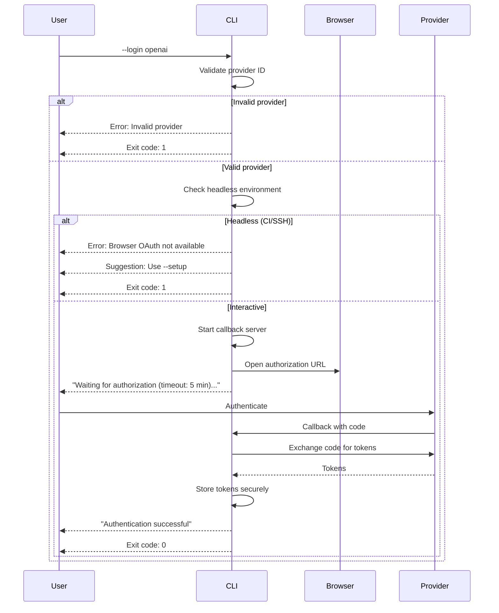

# CLI Reference

Complete reference for OAuth authentication CLI commands.

## Commands Overview

| Command | Description |
|---------|-------------|
| `--login <provider>` | Authenticate with a provider via browser OAuth |
| `--setup` | Interactive setup wizard |
| `--auth-status` | Show authentication status for all providers |
| `--logout [provider]` | Remove stored credentials |

## --login

Authenticate with a provider using browser-based OAuth 2.1 with PKCE.



### Syntax

```bash
# Using npx (no installation required)
npx @stdiobus/workers-registry acp-registry --login <provider>

# Using global install
stdiobus acp-registry --login <provider>
```

### Parameters

| Parameter | Required | Description |
|-----------|----------|-------------|
| `provider` | Yes | Provider ID: `openai`, `anthropic`, `github`, `google`, `azure`, `cognito` |

### Examples

```bash
# Login with OpenAI (npx)
npx @stdiobus/workers-registry acp-registry --login openai

# Login with GitHub (global install)
stdiobus acp-registry --login github
```

### Output

```
[INFO] Running --login command
[INFO] Opening browser for authentication...
[INFO] Waiting for authorization (timeout: 5 minutes)...
[INFO] Authentication successful for openai
```

### Exit Codes

| Code | Description |
|------|-------------|
| 0 | Authentication successful |
| 1 | Authentication failed or cancelled |

### Errors

| Error | Cause | Solution |
|-------|-------|----------|
| `--login requires a provider argument` | Missing provider | Specify a provider ID |
| `Invalid provider` | Unknown provider ID | Use a supported provider |
| `Browser OAuth not available in headless environment` | Running in CI/SSH | Use `--setup` or `api-keys.json` |
| `Authentication timeout` | User didn't complete login | Try again, check browser |

---

## --setup

Interactive setup wizard for configuring authentication.

### Syntax

```bash
# Using npx (no installation required)
npx @stdiobus/workers-registry acp-registry --setup

# Using global install
stdiobus acp-registry --setup
```

### Features

- Select providers to configure
- Choose authentication method (Browser OAuth or Manual API Key)
- Validate credentials before storing
- View current status

### Interactive Flow

```
=== OAuth Authentication Setup ===

Select providers to configure:
  [x] OpenAI
  [ ] Anthropic
  [x] GitHub
  [ ] Google
  [ ] Microsoft Entra ID
  [ ] AWS Cognito

Configuring OpenAI...
  Authentication method:
    (1) Browser OAuth (recommended)
    (2) Manual API Key
  Select [1]: 1

  Opening browser for authentication...
  ✓ OpenAI authenticated successfully

Configuring GitHub...
  Authentication method:
    (1) Browser OAuth (recommended)
    (2) Manual API Key
  Select [1]: 2

  Enter API Key: ********
  ✓ GitHub API key stored

Setup complete!
```

### Exit Codes

| Code | Description |
|------|-------------|
| 0 | Setup completed (even if some providers skipped) |
| 1 | Fatal error during setup |

---

## --auth-status

Display current authentication status for all providers.

### Syntax

```bash
# Using npx (no installation required)
npx @stdiobus/workers-registry acp-registry --auth-status

# Using global install
stdiobus acp-registry --auth-status
```

### Output Format

```
=== OAuth Authentication Status ===

  Openai:
    Status: ✓ Authenticated
    Expires at: 3/26/2026, 10:30:00 AM
    Scope: openid profile
    Last Updated: 3/25/2026, 9:30:00 AM

  Github:
    Status: ○ Not Configured

  Google:
    Status: ○ Not Configured

  Cognito:
    Status: ○ Not Configured

  Azure:
    Status: ○ Not Configured

  Anthropic:
    Status: ⚠ Expired (refresh available)
    Expired at: 3/24/2026, 5:00:00 PM
    Scope: api

--- Summary ---
  Authenticated: 1
  Expired/Failed: 1
  Not Configured: 4

Tip: Run with --setup to configure authentication.
```

### Status Icons

| Icon | Status | Description |
|------|--------|-------------|
| ✓ | Authenticated | Valid, non-expired credentials |
| ⚠ | Expired | Token expired, refresh available |
| ✗ | Refresh Failed | Refresh failed, re-authentication required |
| ○ | Not Configured | No credentials stored |

### Exit Codes

| Code | Description |
|------|-------------|
| 0 | Status displayed successfully |
| 1 | Error reading credentials |

---

## --logout

Remove stored credentials for one or all providers.

### Syntax

```bash
# Logout from all providers (npx)
npx @stdiobus/workers-registry acp-registry --logout

# Logout from specific provider (global install)
stdiobus acp-registry --logout <provider>
```

### Parameters

| Parameter | Required | Description |
|-----------|----------|-------------|
| `provider` | No | Provider ID to logout from. If omitted, logs out from all. |

### Examples

```bash
# Logout from all providers (npx)
npx @stdiobus/workers-registry acp-registry --logout

# Logout from OpenAI only (global install)
stdiobus acp-registry --logout openai
```

### Output

```
# All providers
[INFO] Running --logout command
[INFO] Logging out from all providers...
[INFO] Cleared credentials for openai
[INFO] Cleared credentials for github
[INFO] Logout complete

# Specific provider
[INFO] Running --logout command
[INFO] Logging out from openai...
[INFO] Cleared credentials for openai
[INFO] Logout complete
```

### Exit Codes

| Code | Description |
|------|-------------|
| 0 | Logout successful |
| 1 | Error during logout |

---

## Environment Variables

| Variable | Default | Description |
|----------|---------|-------------|
| `AUTH_AUTO_OAUTH` | `false` | Auto-trigger browser OAuth when agent requires it |
| `REGISTRY_LAUNCHER_API_KEYS_PATH` | `./api-keys.json` | Path to legacy API keys file |

### AUTH_AUTO_OAUTH

Controls automatic OAuth flow triggering:

```bash
# Disable auto-OAuth (default, recommended for production)
AUTH_AUTO_OAUTH=false npx @stdiobus/workers-registry acp-registry

# Enable auto-OAuth (opens browser automatically when needed)
AUTH_AUTO_OAUTH=true stdiobus acp-registry
```

**Warning:** Enabling `AUTH_AUTO_OAUTH` may cause unexpected browser windows in automated environments.

---

## Supported Providers

| Provider ID | Name |
|-------------|------|
| `openai` | OpenAI |
| `anthropic` | Anthropic |
| `github` | GitHub |
| `google` | Google |
| `azure` | Microsoft Entra ID |
| `cognito` | AWS Cognito |

> **Note:** The provider ID `azure` is kept for backward compatibility. Microsoft renamed Azure AD to Microsoft Entra ID in 2023.

---

## Output Streams

All CLI commands follow the NDJSON protocol requirements:

- **stdout**: Reserved for NDJSON protocol messages (not used by CLI commands)
- **stderr**: All CLI output, logs, and status messages

This ensures CLI commands don't interfere with the NDJSON protocol when used in pipelines.
