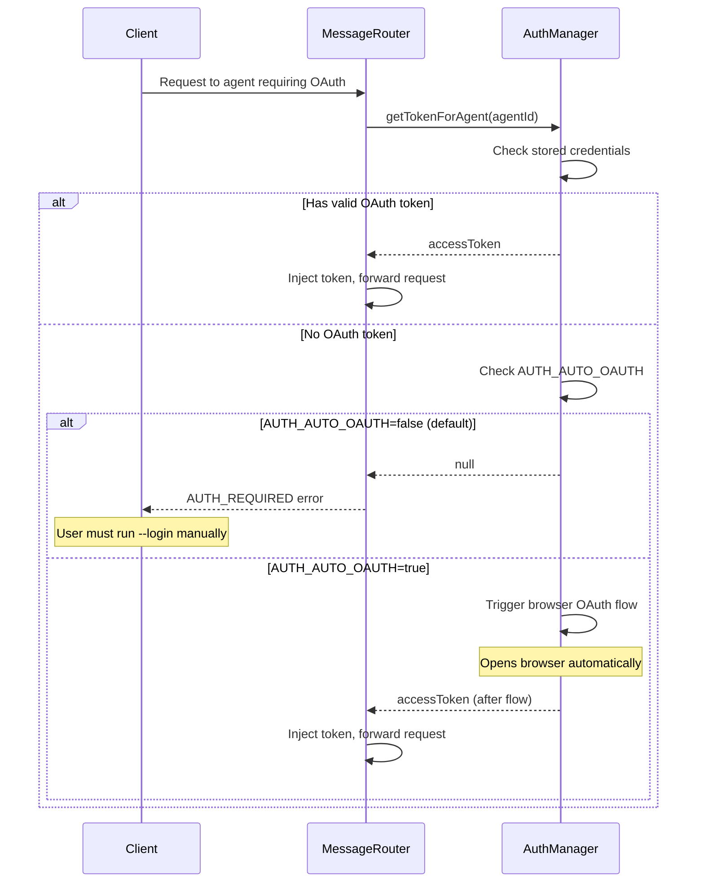

# Configuration

Configuration options for OAuth 2.1 authentication.

## Environment Variables

### AUTH_AUTO_OAUTH

Controls automatic OAuth flow triggering when an agent requires authentication.

| Value | Behavior |
|-------|----------|
| `false` (default) | OAuth only via explicit `--login` command |
| `true` | Auto-opens browser when agent requires OAuth |



```bash
# Default: manual OAuth only
AUTH_AUTO_OAUTH=false node ./launch/index.js acp-registry

# Auto-trigger OAuth (use with caution)
AUTH_AUTO_OAUTH=true node ./launch/index.js acp-registry
```

**Recommendation:** Keep `AUTH_AUTO_OAUTH=false` in production to prevent unexpected browser windows.

### REGISTRY_LAUNCHER_API_KEYS_PATH

Path to the legacy `api-keys.json` file.

| Default | `./api-keys.json` |
|---------|-------------------|

```bash
REGISTRY_LAUNCHER_API_KEYS_PATH=/etc/stdio-bus/api-keys.json node ./launch/index.js acp-registry
```

### ACP_REGISTRY_URL

URL to fetch the ACP Registry from.

| Default | `https://cdn.agentclientprotocol.com/registry/v1/latest/registry.json` |
|---------|------------------------------------------------------------------------|

```bash
ACP_REGISTRY_URL=https://custom.registry.example.com/registry.json node ./launch/index.js acp-registry
```

---

## api-keys.json (Legacy)

The legacy API keys configuration file is still fully supported.

### Location

Default: `./api-keys.json` (relative to working directory)

Override with `REGISTRY_LAUNCHER_API_KEYS_PATH` environment variable.

### Format

```json
{
  "agent-id": {
    "apiKey": "your-api-key",
    "env": {
      "PROVIDER_API_KEY": "your-api-key"
    }
  }
}
```

### Example

```json
{
  "claude-acp": {
    "apiKey": "sk-ant-api03-...",
    "env": {
      "ANTHROPIC_API_KEY": "sk-ant-api03-..."
    }
  },
  "openai-agent": {
    "apiKey": "sk-proj-...",
    "env": {
      "OPENAI_API_KEY": "sk-proj-..."
    }
  },
  "github-copilot": {
    "apiKey": "ghp_...",
    "env": {
      "GITHUB_TOKEN": "ghp_..."
    }
  }
}
```

### Fields

| Field | Type | Description |
|-------|------|-------------|
| `apiKey` | string | API key for the agent |
| `env` | object | Environment variables to inject into agent process |

---

## Credential Precedence

When multiple credential sources are available:

1. **OAuth tokens** (highest priority)
2. **API keys from api-keys.json**
3. **Environment variables**

OAuth credentials always take precedence when available.

---

## Storage Backends

### OS Keychain (Preferred)

Tokens are stored in the operating system's secure credential storage:

| OS | Backend |
|----|---------|
| macOS | Keychain |
| Windows | Credential Manager |
| Linux | Secret Service (GNOME Keyring, KWallet) |

**Service name:** `stdio-bus-oauth`

### Encrypted File (Fallback)

When keychain is unavailable, tokens are stored in an encrypted file:

| Location | `~/.config/stdio-bus/oauth-credentials.enc` |
|----------|---------------------------------------------|
| Encryption | AES-256-GCM |
| Key derivation | Machine-specific (hostname, user, etc.) |

---

## Provider Configuration

### OpenAI

```
Authorization URL: https://auth.openai.com/authorize
Token URL: https://auth.openai.com/token
Default Scopes: openid, profile
Token Injection: Authorization: Bearer <token>
```

### Anthropic

```
Authorization URL: https://auth.anthropic.com/authorize
Token URL: https://auth.anthropic.com/token
Default Scopes: api
Token Injection: x-api-key: <token>
```

### GitHub

```
Authorization URL: https://github.com/login/oauth/authorize
Token URL: https://github.com/login/oauth/access_token
Default Scopes: read:user
Token Injection: Authorization: Bearer <token>
```

### Google

```
Authorization URL: https://accounts.google.com/o/oauth2/v2/auth
Token URL: https://oauth2.googleapis.com/token
Default Scopes: openid, profile, email
Token Injection: Authorization: Bearer <token>
```

### Azure AD

```
Authorization URL: https://login.microsoftonline.com/{tenant}/oauth2/v2.0/authorize
Token URL: https://login.microsoftonline.com/{tenant}/oauth2/v2.0/token
Default Scopes: openid, profile
Token Injection: Authorization: Bearer <token>
```

### AWS Cognito

```
Authorization URL: https://{domain}.auth.{region}.amazoncognito.com/oauth2/authorize
Token URL: https://{domain}.auth.{region}.amazoncognito.com/oauth2/token
Default Scopes: openid, profile
Token Injection: Authorization: Bearer <token>
```

---

## Token Refresh

### Automatic Refresh

Tokens are automatically refreshed:
- **Proactive:** 5 minutes before expiration
- **On-demand:** When a request is made with an expired token

### Refresh Token Rotation

When a provider returns a new refresh token during refresh, it's automatically stored.

### Concurrent Refresh

Multiple concurrent refresh requests are serialized to prevent race conditions.

---

## Headless Environment Detection

The following conditions indicate a headless environment:

| Condition | Check |
|-----------|-------|
| CI environment | `CI` env var is set |
| Headless flag | `HEADLESS` env var is set |
| SSH session | `SSH_TTY` env var is set |
| No TTY | `process.stdout.isTTY` is false |

In headless environments:
- Browser OAuth is disabled
- Clear error message is shown
- Suggestion to use `--setup` or `api-keys.json`
