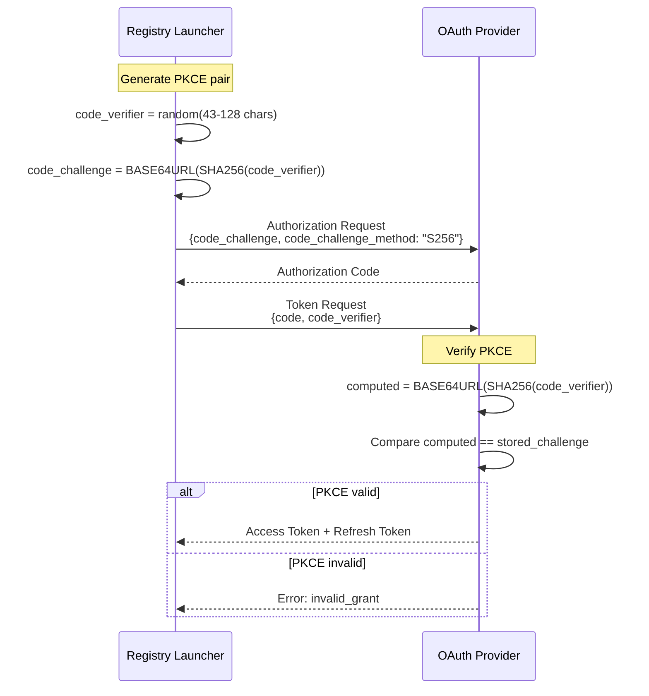
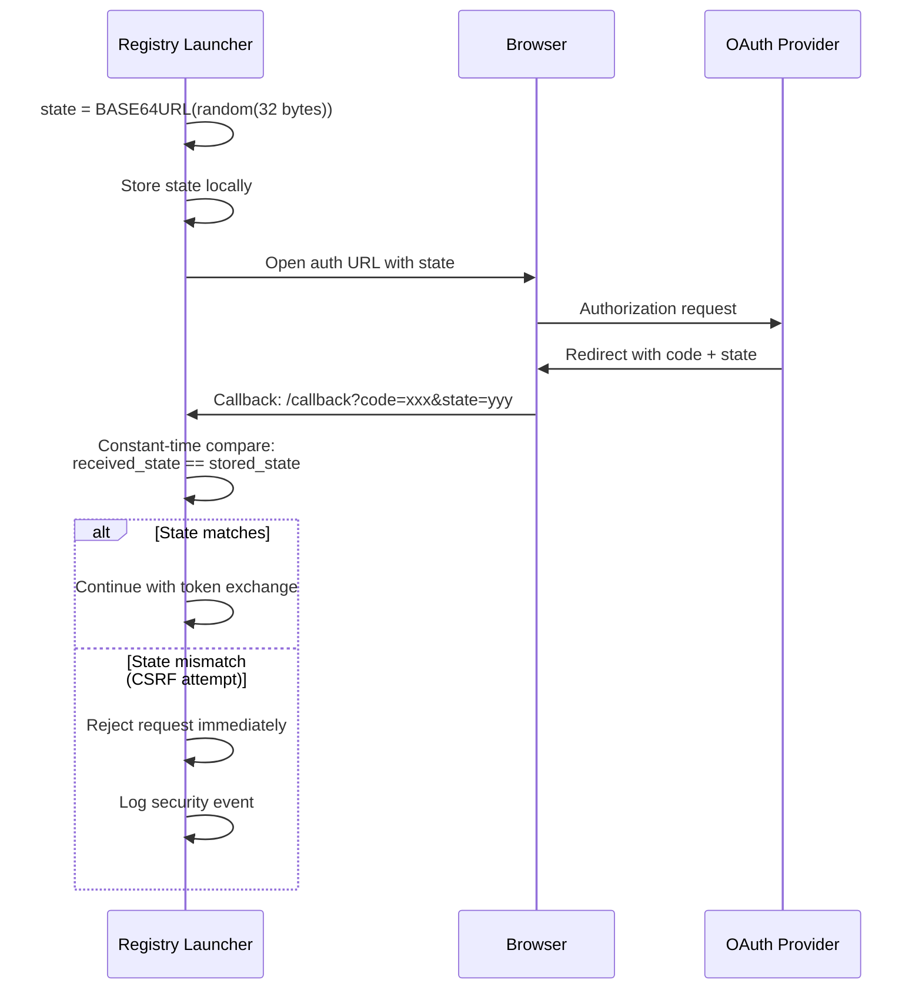
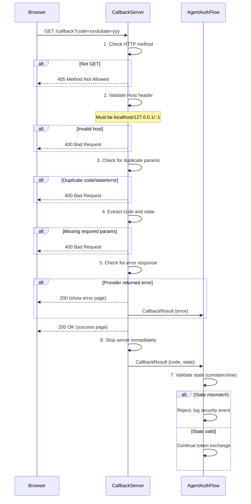
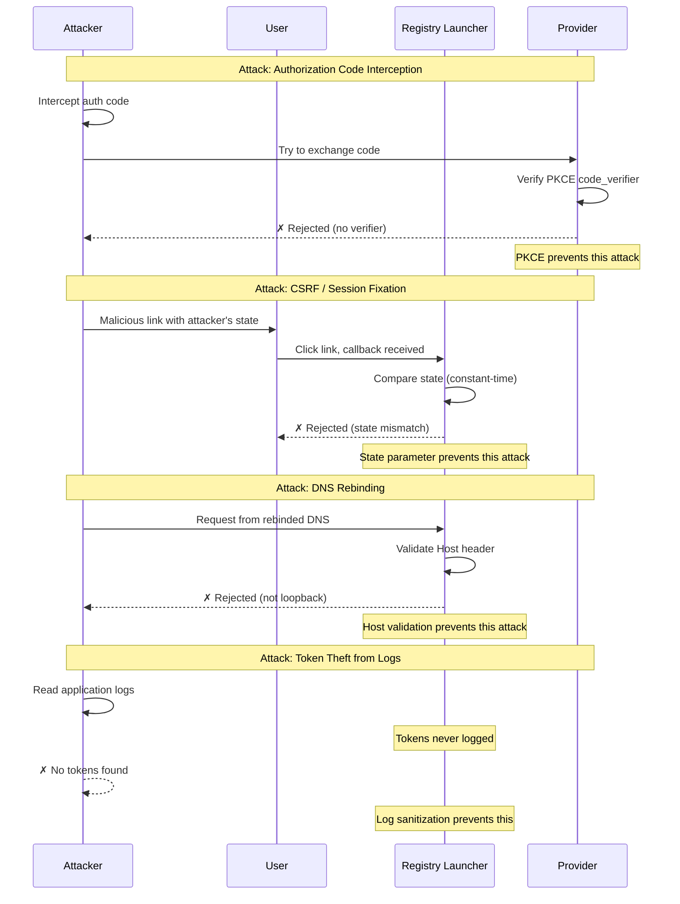

# Security

Security considerations and best practices for OAuth 2.1 authentication.

## OAuth 2.1 Security Features

### PKCE (Proof Key for Code Exchange)

All OAuth flows use PKCE with S256 method:



- **Code Verifier:** 43-128 character random string
- **Code Challenge:** SHA-256 hash of verifier, base64url encoded
- **Method:** S256 (SHA-256)

PKCE prevents authorization code interception attacks.

### State Parameter



- **Minimum entropy:** 256 bits (32 bytes)
- **Encoding:** Base64url without padding
- **Validation:** Constant-time comparison
- **Uniqueness:** Cryptographically random per request

State parameter prevents CSRF attacks.

---

## Callback Server Security

### Callback Validation Pipeline



### Loopback-Only Binding

The callback server binds only to loopback addresses:
- `127.0.0.1` (IPv4)
- `::1` (IPv6)

External connections are rejected.

### Single-Request Lifecycle

The callback server:
1. Accepts exactly one request
2. Closes immediately after processing
3. Has a 5-minute timeout

### Host Header Validation

Requests must have a valid Host header:
- Must be `localhost`, `127.0.0.1`, or `::1`
- Port must match the server's port
- Prevents DNS rebinding attacks

### HTTP Method Restriction

Only GET requests are accepted. Other methods return 405 Method Not Allowed.

### Duplicate Parameter Rejection

Requests with duplicate `code`, `state`, or `error` parameters are rejected.

### Security Headers

All responses include:
```
Cache-Control: no-store, no-cache, must-revalidate
Pragma: no-cache
X-Content-Type-Options: nosniff
X-Frame-Options: DENY
Content-Security-Policy: default-src 'none'
```

---

## Token Storage Security

### OS Keychain (Preferred)

Tokens are stored in the OS secure credential storage:

| OS | Backend | Security |
|----|---------|----------|
| macOS | Keychain | Hardware-backed encryption |
| Windows | Credential Manager | DPAPI encryption |
| Linux | Secret Service | User session encryption |

### Encrypted File (Fallback)

When keychain is unavailable:

| Algorithm | AES-256-GCM |
|-----------|-------------|
| Key derivation | PBKDF2 with machine-specific salt |
| Salt components | Hostname, username, machine ID |
| File permissions | 0600 (owner read/write only) |

---

## Sensitive Data Protection

### Logging Policy

The following are NEVER logged:
- Access tokens
- Refresh tokens
- Authorization codes
- Client secrets
- API keys
- State parameters
- Code verifiers

### Error Messages

Error messages are sanitized to exclude:
- Token values
- Authorization codes
- Client credentials
- Full URLs with query parameters

### Memory Handling

Sensitive data is:
- Not stored in global variables
- Cleared after use when possible
- Not included in stack traces

---

## Network Security

### HTTPS Enforcement

All OAuth endpoints must use HTTPS:
- Authorization URL
- Token URL
- Redirect URI (localhost exception)

HTTP endpoints are rejected with a clear error.

### URL Validation

Before browser launch:
- URL must be HTTPS
- URL parameters are sanitized
- No shell injection possible (uses `open` package)

---

## Threat Model

### Security Flow Overview



### Mitigated Threats

| Threat | Mitigation |
|--------|------------|
| Authorization code interception | PKCE with S256 |
| CSRF attacks | State parameter with high entropy |
| DNS rebinding | Host header validation |
| Token theft from logs | Sensitive data redaction |
| Token theft from storage | OS keychain or encrypted file |
| Replay attacks | Single-use authorization codes |
| Session fixation | Random state per request |

### Residual Risks

| Risk | Mitigation |
|------|------------|
| Malware on user's machine | Out of scope (OS security) |
| Compromised browser | Out of scope (browser security) |
| Provider compromise | Out of scope (provider security) |
| Physical access to machine | OS keychain provides some protection |

---

## Best Practices

### For Users

1. **Use browser OAuth** instead of API keys when possible
2. **Keep your OS updated** for latest security patches
3. **Don't share credentials** or copy them between machines
4. **Use `--logout`** when done with a shared machine
5. **Review `--auth-status`** periodically

### For Deployments

1. **Keep `AUTH_AUTO_OAUTH=false`** in production
2. **Use `api-keys.json`** for automated environments
3. **Restrict file permissions** on credential files
4. **Monitor authentication failures** in logs
5. **Rotate API keys** periodically

### For CI/CD

1. **Use environment variables** for API keys
2. **Don't store OAuth tokens** in CI
3. **Use service accounts** when available
4. **Limit token scopes** to minimum required

---

## Incident Response

### If Tokens Are Compromised

1. **Logout immediately:** `--logout <provider>`
2. **Revoke tokens** at the provider's security settings
3. **Re-authenticate:** `--login <provider>`
4. **Review access logs** at the provider

### If API Keys Are Compromised

1. **Revoke the key** at the provider
2. **Generate a new key**
3. **Update `api-keys.json`**
4. **Review access logs** at the provider

---

## Compliance

### Data Handling

- Tokens are stored locally only
- No telemetry or analytics
- No data sent to third parties
- User controls all credential storage

### Audit Trail

Authentication events are logged to stderr:
- Login attempts (success/failure)
- Token refresh (success/failure)
- Logout operations

Sensitive data is never included in logs.
