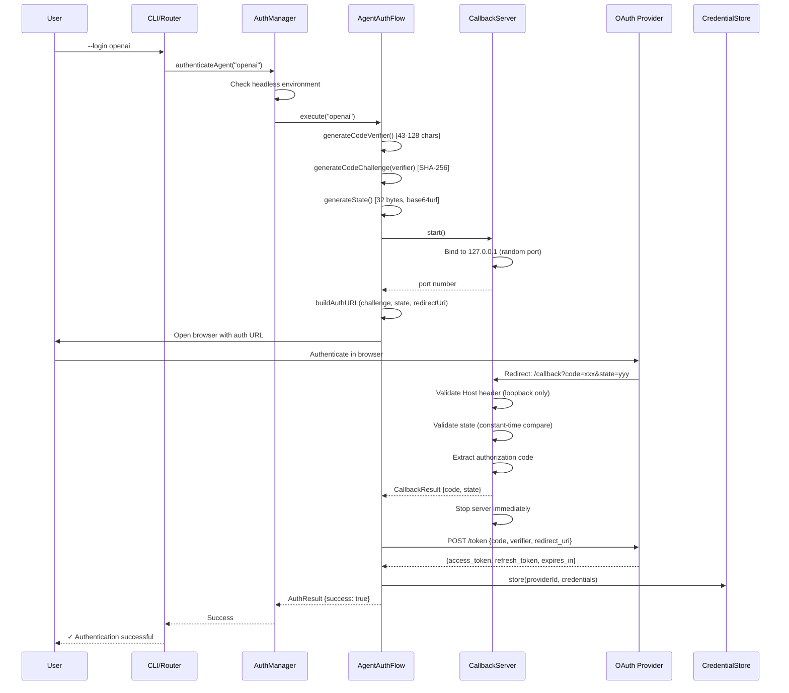
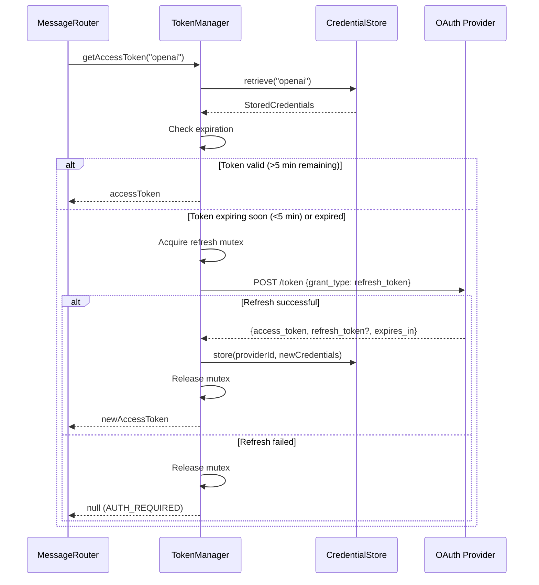
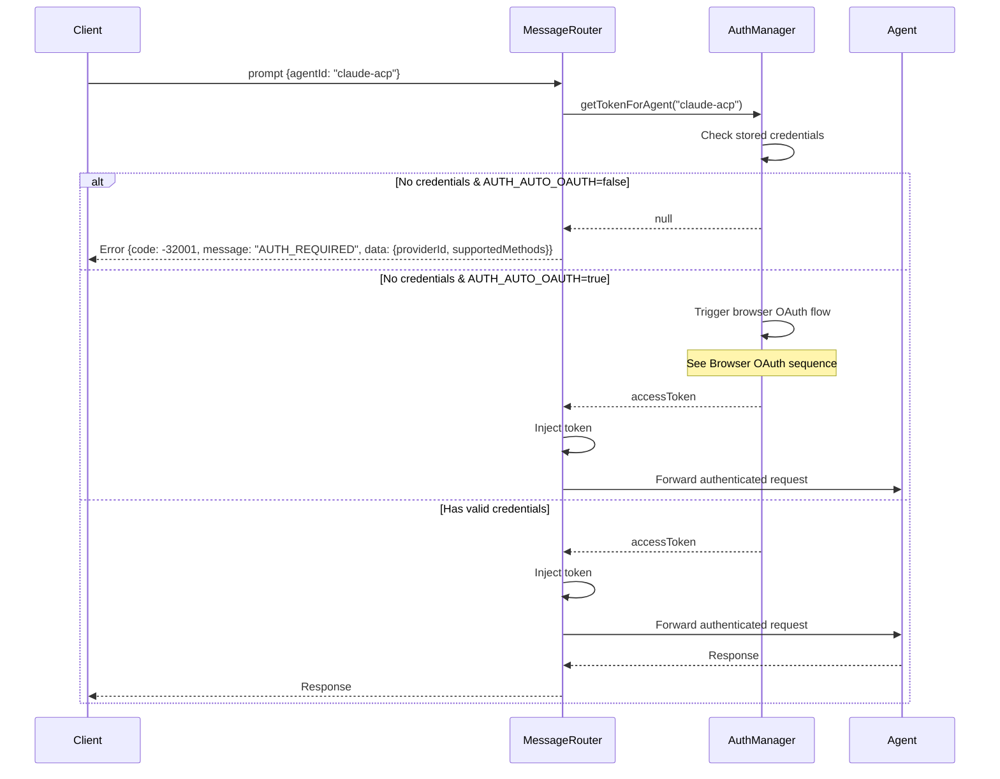
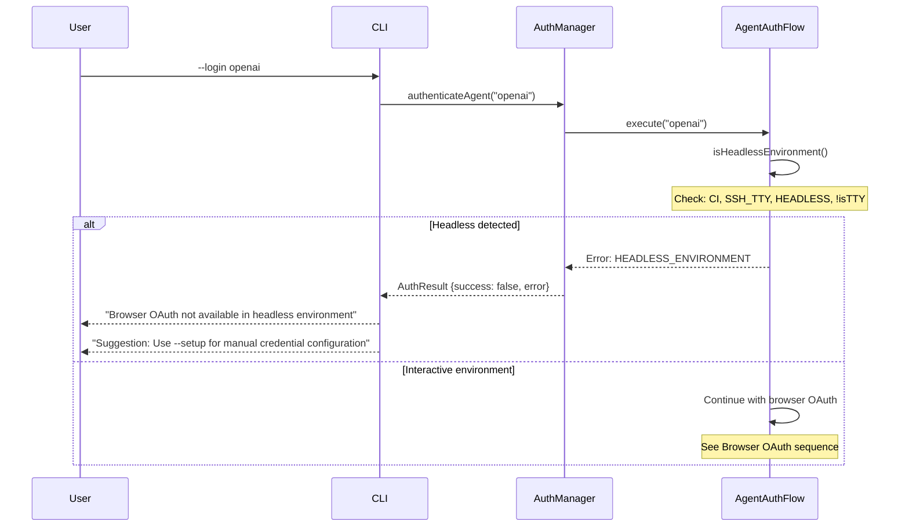
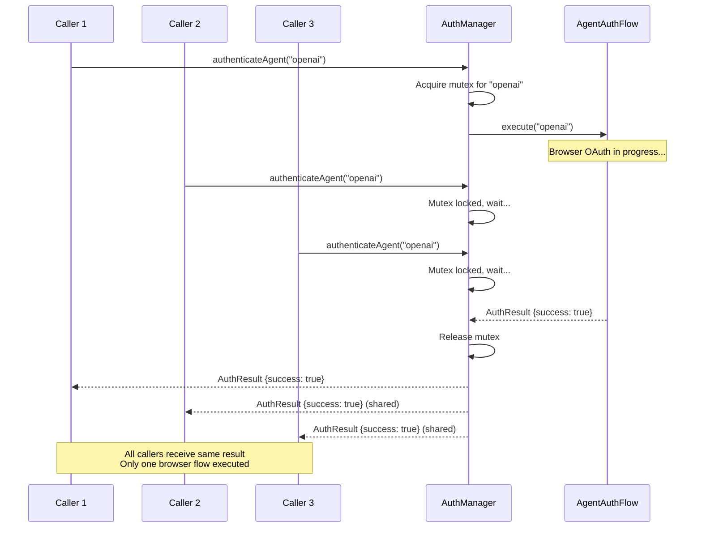

# Technical Reference

Architecture and implementation details for OAuth 2.1 authentication.

## Architecture Overview

```
┌─────────────────────────────────────────────────────────────────┐
│                      Registry Launcher                          │
├─────────────────────────────────────────────────────────────────┤
│                                                                 │
│  ┌─────────────┐    ┌──────────────┐    ┌─────────────────┐   │
│  │ CLI Parser  │───▶│ Auth Manager │───▶│ Message Router  │   │
│  └─────────────┘    └──────────────┘    └─────────────────┘   │
│         │                  │                     │             │
│         ▼                  ▼                     ▼             │
│  ┌─────────────┐    ┌──────────────┐    ┌─────────────────┐   │
│  │ CLI Commands│    │Token Manager │    │ Agent Runtime   │   │
│  │ --login     │    └──────────────┘    └─────────────────┘   │
│  │ --setup     │           │                                   │
│  │ --status    │           ▼                                   │
│  │ --logout    │    ┌──────────────┐                          │
│  └─────────────┘    │Credential    │                          │
│                     │Store         │                          │
│                     └──────────────┘                          │
│                            │                                   │
│              ┌─────────────┴─────────────┐                    │
│              ▼                           ▼                    │
│       ┌──────────────┐           ┌──────────────┐            │
│       │ OS Keychain  │           │Encrypted File│            │
│       └──────────────┘           └──────────────┘            │
│                                                                │
└─────────────────────────────────────────────────────────────────┘
```

## Module Structure

```
workers-registry/acp-worker/src/registry-launcher/auth/
├── index.ts                 # Public API exports
├── types.ts                 # Type definitions
├── auth-manager.ts          # Main orchestrator
├── token-manager.ts         # Token lifecycle management
├── errors.ts                # Error types and parsing
│
├── cli/                     # CLI commands
│   ├── index.ts
│   ├── login-command.ts     # --login implementation
│   ├── setup-command.ts     # --setup implementation
│   ├── status-command.ts    # --auth-status implementation
│   └── logout-command.ts    # --logout implementation
│
├── flows/                   # Authentication flows
│   ├── agent-auth-flow.ts   # Browser OAuth flow
│   ├── terminal-auth-flow.ts # Interactive terminal flow
│   ├── callback-server.ts   # OAuth callback server
│   ├── pkce.ts              # PKCE implementation
│   ├── state.ts             # State parameter handling
│   └── session.ts           # Auth session management
│
├── providers/               # OAuth providers
│   ├── index.ts             # Provider registry
│   ├── base-provider.ts     # Abstract base class
│   ├── openai-provider.ts
│   ├── anthropic-provider.ts
│   ├── github-provider.ts
│   ├── google-provider.ts
│   ├── azure-provider.ts
│   └── cognito-provider.ts
│
└── storage/                 # Credential storage
    ├── credential-store.ts  # Storage facade
    ├── keychain-backend.ts  # OS keychain backend
    ├── encrypted-file-backend.ts
    └── memory-backend.ts    # For testing
```

## Core Components

### AuthManager

Main orchestrator for authentication operations.

```typescript
class AuthManager {
  // Authenticate with a provider via browser OAuth
  async authenticateAgent(providerId: AuthProviderId): Promise<AuthResult>;
  
  // Get token for an agent (with auto-refresh)
  async getTokenForAgent(agentId: string): Promise<string | null>;
  
  // Inject authentication into a request
  async injectAuth(agentId: string, request: object): Promise<object>;
  
  // Get status for all providers
  async getStatus(): Promise<Map<AuthProviderId, AuthStatusEntry>>;
  
  // Logout from provider(s)
  async logout(providerId?: AuthProviderId): Promise<void>;
  
  // Check if re-authentication is required
  async requiresReauth(providerId: AuthProviderId): Promise<boolean>;
}
```

### TokenManager

Manages token lifecycle including storage and refresh.

```typescript
class TokenManager {
  // Get access token (refreshes if needed)
  async getAccessToken(providerId: AuthProviderId): Promise<string | null>;
  
  // Store tokens from OAuth response
  async storeTokens(providerId: AuthProviderId, tokens: TokenResponse): Promise<void>;
  
  // Check if valid tokens exist
  async hasValidTokens(providerId: AuthProviderId): Promise<boolean>;
  
  // Force token refresh
  async forceRefresh(providerId: AuthProviderId): Promise<string | null>;
  
  // Clear tokens
  async clearTokens(providerId?: AuthProviderId): Promise<void>;
}
```

### CredentialStore

Facade for credential storage backends.

```typescript
class CredentialStore {
  // Store credentials
  async store(providerId: AuthProviderId, credentials: StoredCredentials): Promise<void>;
  
  // Retrieve credentials
  async retrieve(providerId: AuthProviderId): Promise<StoredCredentials | null>;
  
  // Delete credentials
  async delete(providerId: AuthProviderId): Promise<void>;
  
  // List all stored provider IDs
  async list(): Promise<AuthProviderId[]>;
}
```

### AgentAuthFlow

Orchestrates browser-based OAuth flow.

```typescript
class AgentAuthFlow {
  // Execute OAuth flow
  async execute(providerId: AuthProviderId): Promise<AuthResult>;
  
  // Validate provider configuration
  validateProviderConfig(providerId: AuthProviderId): void;
  
  // Check if environment supports browser OAuth
  static isHeadlessEnvironment(): boolean;
}
```

### CallbackServer

HTTP server for OAuth callbacks.

```typescript
class CallbackServer {
  // Start server on random port
  async start(): Promise<number>;
  
  // Wait for callback (with timeout)
  async waitForCallback(timeoutMs: number): Promise<CallbackResult>;
  
  // Stop server
  async stop(): Promise<void>;
}
```

## Message Router Integration

The MessageRouter integrates with AuthManager for automatic authentication.

### authMethods Injection

On initialize response, the router injects supported auth methods:

```typescript
// In handleAgentResponse()
if (isInitializeResponse) {
  const ourAuthMethods = this.getSupportedAuthMethods();
  response.result.authMethods = [
    ...ourAuthMethods,
    ...existingAuthMethods
  ];
}
```

### AUTH_REQUIRED Enforcement

When an agent requires OAuth but credentials aren't available:

```typescript
// In route()
if (agentRequiresOAuth && !hasOAuthCredentials) {
  return {
    jsonrpc: '2.0',
    id: requestId,
    error: {
      code: -32001,
      message: 'AUTH_REQUIRED',
      data: {
        requiredMethod: 'oauth2',
        providerId: requiredProviderId,
        supportedMethods: this.getSupportedAuthMethods()
      }
    }
  };
}
```

### Token Injection

Tokens are injected into agent requests:

```typescript
// In injectAuthentication()
const token = await this.authManager.getTokenForAgent(agentId);
if (token) {
  const provider = getProvider(providerId);
  return provider.injectToken(request, token);
}
```

## OAuth Flow Sequence

### Browser OAuth with PKCE



### Token Refresh Flow



### authMethods Injection Flow


### AUTH_REQUIRED Enforcement



### Headless Environment Fallback



### Concurrent Auth Serialization



## Type Definitions

### AuthProviderId

```typescript
type AuthProviderId = 'openai' | 'anthropic' | 'github' | 'google' | 'azure' | 'cognito';
```

### TokenResponse

```typescript
interface TokenResponse {
  access_token: string;
  token_type: string;
  expires_in?: number;
  refresh_token?: string;
  scope?: string;
}
```

### StoredCredentials

```typescript
interface StoredCredentials {
  accessToken: string;
  refreshToken?: string;
  expiresAt?: number;
  scope?: string;
  tokenType: string;
  providerId: AuthProviderId;
  createdAt: number;
  lastRefresh?: number;
}
```

### AuthResult

```typescript
interface AuthResult {
  success: boolean;
  providerId: AuthProviderId;
  error?: AuthError;
  tokens?: TokenResponse;
}
```

### AuthStatusEntry

```typescript
interface AuthStatusEntry {
  providerId: AuthProviderId;
  status: TokenStatus;
  expiresAt?: number;
  scope?: string;
  lastRefresh?: number;
}

type TokenStatus = 'authenticated' | 'expired' | 'refresh-failed' | 'not-configured';
```

## Error Codes

| Code | Name | Description |
|------|------|-------------|
| `AUTH_REQUIRED` | Authentication required | Agent requires OAuth but no credentials |
| `INVALID_PROVIDER` | Invalid provider | Unknown provider ID |
| `TOKEN_EXPIRED` | Token expired | Access token expired, refresh failed |
| `REFRESH_FAILED` | Refresh failed | Token refresh failed |
| `CALLBACK_TIMEOUT` | Callback timeout | OAuth callback not received in time |
| `STATE_MISMATCH` | State mismatch | OAuth state parameter doesn't match |
| `HEADLESS_ENVIRONMENT` | Headless environment | Browser OAuth not available |

## Testing

### Unit Tests

```bash
cd workers-registry/acp-worker
npm test -- --testPathPattern="auth"
```

### Integration Tests

```bash
npm test -- --testPathPattern="integration"
```

### E2E Tests

```bash
npm test -- --testPathPattern="auth-flow.e2e"
```

### Test Coverage

- PKCE generation and validation
- State parameter handling
- Token storage and retrieval
- Token refresh logic
- Callback server security
- Provider configuration
- CLI commands
- MessageRouter integration
