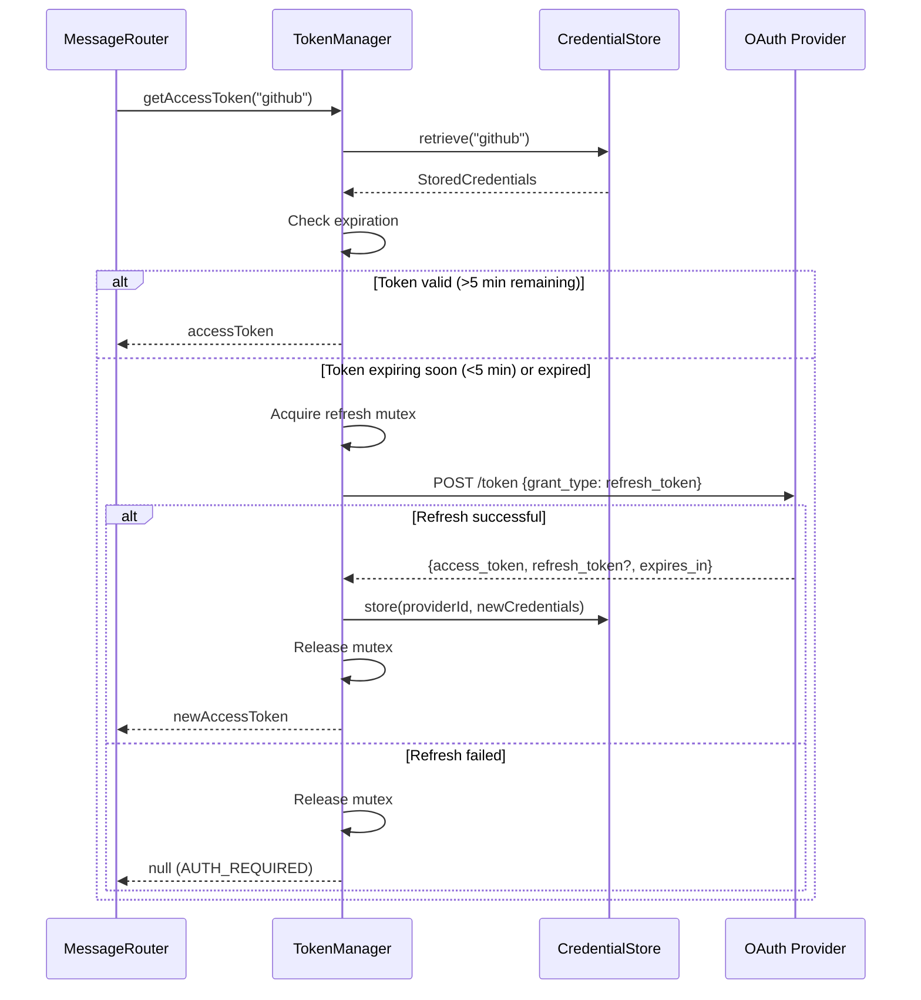
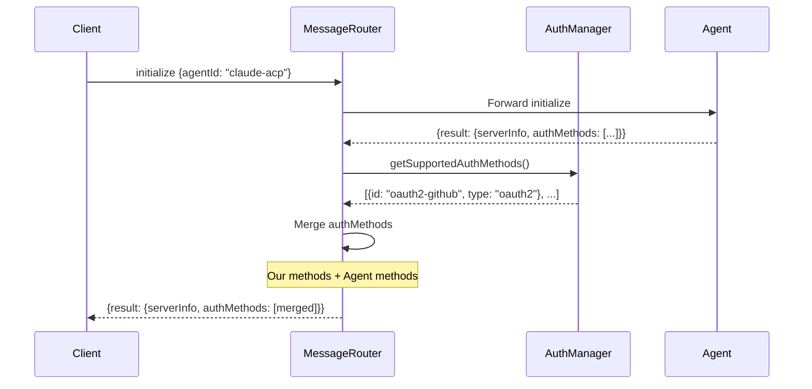
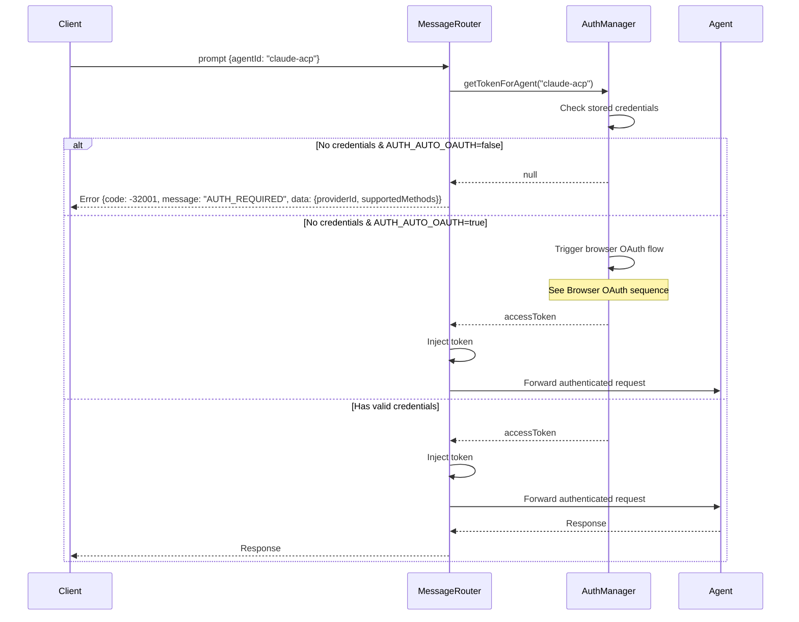
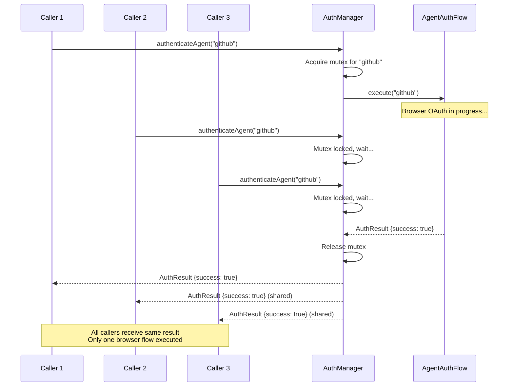

# Technical Reference

Architecture and implementation details for OAuth 2.1 authentication.

## Architecture Overview

```
┌─────────────────────────────────────────────────────────────────┐
│                      Registry Launcher                          │
├─────────────────────────────────────────────────────────────────┤
│                                                                 │
│  ┌─────────────┐    ┌──────────────┐    ┌─────────────────┐   │
│  │ CLI Parser  │───▶│ Auth Manager │───▶│ Message Router  │   │
│  └─────────────┘    └──────────────┘    └─────────────────┘   │
│         │                  │                     │             │
│         ▼                  ▼                     ▼             │
│  ┌─────────────┐    ┌──────────────┐    ┌─────────────────┐   │
│  │ CLI Commands│    │Token Manager │    │ Agent Runtime   │   │
│  │ --login     │    └──────────────┘    └─────────────────┘   │
│  │ --setup     │           │                                   │
│  │ --status    │           ▼                                   │
│  │ --logout    │    ┌──────────────┐                          │
│  └─────────────┘    │Credential    │                          │
│                     │Store         │                          │
│                     └──────────────┘                          │
│                            │                                   │
│              ┌─────────────┴─────────────┐                    │
│              ▼                           ▼                    │
│       ┌──────────────┐           ┌──────────────┐            │
│       │ OS Keychain  │           │Encrypted File│            │
│       └──────────────┘           └──────────────┘            │
│                                                                │
│  ┌─────────────────────────────────────────────────────────┐  │
│  │                    OAuth Providers                       │  │
│  │  ┌────────┐ ┌────────┐ ┌─────────┐ ┌────────┐ ┌──────┐ │  │
│  │  │ GitHub │ │ Google │ │ Entra ID│ │Cognito │ │ OIDC │ │  │
│  │  └────────┘ └────────┘ └─────────┘ └────────┘ └──────┘ │  │
│  └─────────────────────────────────────────────────────────┘  │
│                                                                │
│  ┌─────────────────────────────────────────────────────────┐  │
│  │                  Model Credentials                       │  │
│  │  ┌─────────────────────┐  ┌─────────────────────────┐   │  │
│  │  │ OpenAI API Key      │  │ Anthropic API Key       │   │  │
│  │  │ (Authorization hdr) │  │ (x-api-key header)      │   │  │
│  │  └─────────────────────┘  └─────────────────────────┘   │  │
│  └─────────────────────────────────────────────────────────┘  │
│                                                                │
└─────────────────────────────────────────────────────────────────┘
```

## Important Distinction: OAuth vs API Keys

The authentication system separates two distinct concerns:

| Category | Purpose | Providers | Authentication Method |
|----------|---------|-----------|----------------------|
| User Identity (OAuth/OIDC) | Authenticate end users | GitHub, Google, Microsoft Entra ID, AWS Cognito, Generic OIDC | OAuth 2.1 with PKCE |
| Model API Access | Access AI model APIs | OpenAI, Anthropic | API Keys |

**OpenAI and Anthropic do NOT offer public OAuth IdP for third-party login.** They use API keys for authentication. This is why they are handled separately in the Model Credentials module.

## Module Structure

```
workers-registry/registry-launcher/src/auth/
├── index.ts                 # Public API exports
├── types.ts                 # Type definitions
├── auth-manager.ts          # Main orchestrator
├── token-manager.ts         # Token lifecycle management
├── errors.ts                # Error types and parsing
├── pkce.ts                  # PKCE implementation
├── state.ts                 # State parameter handling
├── session.ts               # Auth session management
│
├── cli/                     # CLI commands
│   ├── index.ts
│   ├── login-command.ts     # --login implementation
│   ├── setup-command.ts     # --setup implementation
│   ├── status-command.ts    # --auth-status implementation
│   └── logout-command.ts    # --logout implementation
│
├── flows/                   # Authentication flows
│   ├── agent-auth-flow.ts   # Browser OAuth flow
│   ├── terminal-auth-flow.ts # Interactive terminal flow
│   └── callback-server.ts   # OAuth callback server
│
├── providers/               # OAuth providers (user identity)
│   ├── index.ts             # Provider registry
│   ├── base-provider.ts     # Abstract base class
│   ├── github-provider.ts   # GitHub OAuth
│   ├── google-provider.ts   # Google OAuth
│   ├── entra-provider.ts    # Microsoft Entra ID (formerly Azure AD)
│   ├── cognito-provider.ts  # AWS Cognito
│   └── oidc-provider.ts     # Generic OIDC Discovery
│
├── model-credentials/       # Model API credentials (API keys)
│   ├── index.ts             # Model credentials exports
│   ├── types.ts             # Model credential interfaces
│   ├── openai-api-key.ts    # OpenAI API key handler
│   └── anthropic-api-key.ts # Anthropic API key handler
│
└── storage/                 # Credential storage
    ├── credential-store.ts  # Storage facade
    ├── keychain-backend.ts  # OS keychain backend
    ├── encrypted-file-backend.ts
    └── memory-backend.ts    # For testing
```

## Core Components

### AuthManager

Main orchestrator for authentication operations.

```typescript
class AuthManager {
  // Authenticate with a provider via browser OAuth
  async authenticateAgent(providerId: AuthProviderId): Promise<AuthResult>;
  
  // Get token for an agent (with auto-refresh)
  async getTokenForAgent(agentId: string): Promise<string | null>;
  
  // Get model credential (API key) for a model provider
  async getModelCredential(providerId: ModelProviderId): Promise<string | null>;
  
  // Inject authentication into a request
  async injectAuth(agentId: string, request: object): Promise<object>;
  
  // Get status for all providers
  async getStatus(): Promise<Map<AuthProviderId, AuthStatusEntry>>;
  
  // Logout from provider(s)
  async logout(providerId?: AuthProviderId): Promise<void>;
  
  // Check if re-authentication is required
  async requiresReauth(providerId: AuthProviderId): Promise<boolean>;
}
```

### TokenManager

Manages token lifecycle including storage and refresh.

```typescript
class TokenManager {
  // Get access token (refreshes if needed)
  async getAccessToken(providerId: AuthProviderId): Promise<string | null>;
  
  // Store tokens from OAuth response
  async storeTokens(providerId: AuthProviderId, tokens: TokenResponse): Promise<void>;
  
  // Check if valid tokens exist
  async hasValidTokens(providerId: AuthProviderId): Promise<boolean>;
  
  // Force token refresh
  async forceRefresh(providerId: AuthProviderId): Promise<string | null>;
  
  // Clear tokens
  async clearTokens(providerId?: AuthProviderId): Promise<void>;
}
```

### CredentialStore

Facade for credential storage backends.

```typescript
class CredentialStore {
  // Store credentials
  async store(providerId: AuthProviderId, credentials: StoredCredentials): Promise<void>;
  
  // Retrieve credentials
  async retrieve(providerId: AuthProviderId): Promise<StoredCredentials | null>;
  
  // Delete credentials
  async delete(providerId: AuthProviderId): Promise<void>;
  
  // List all stored provider IDs
  async list(): Promise<AuthProviderId[]>;
}
```

### AgentAuthFlow

Orchestrates browser-based OAuth flow.

```typescript
class AgentAuthFlow {
  // Execute OAuth flow
  async execute(providerId: AuthProviderId): Promise<AuthResult>;
  
  // Validate provider configuration
  validateProviderConfig(providerId: AuthProviderId): void;
  
  // Check if environment supports browser OAuth
  static isHeadlessEnvironment(): boolean;
}
```

### CallbackServer

HTTP server for OAuth callbacks.

```typescript
class CallbackServer {
  // Start server on random port
  async start(): Promise<number>;
  
  // Wait for callback (with timeout)
  async waitForCallback(timeoutMs: number): Promise<CallbackResult>;
  
  // Stop server
  async stop(): Promise<void>;
}
```

## Model Credentials Module

The Model Credentials module handles API key authentication for upstream model providers (OpenAI, Anthropic). These providers do NOT support OAuth for third-party login.

### OpenAIApiKeyHandler

Handles OpenAI API key storage and injection.

```typescript
class OpenAIApiKeyHandler {
  // Get the provider ID
  getProviderId(): ModelProviderId; // returns 'openai'
  
  // Validate API key format
  validateFormat(apiKey: string): { valid: boolean; warning?: string };
  
  // Store API key securely
  async store(apiKey: string, label?: string): Promise<void>;
  
  // Retrieve stored API key
  async retrieve(): Promise<ModelCredentialResult>;
  
  // Delete stored API key
  async delete(): Promise<void>;
  
  // Check if API key is configured
  async isConfigured(): Promise<boolean>;
  
  // Get credential status
  async getStatus(): Promise<ModelCredentialStatusEntry>;
  
  // Inject API key into request headers
  // Injects: Authorization: Bearer {key}
  async injectHeader(headers: Record<string, string>): Promise<Record<string, string>>;
}
```

### AnthropicApiKeyHandler

Handles Anthropic API key storage and injection.

```typescript
class AnthropicApiKeyHandler {
  // Get the provider ID
  getProviderId(): ModelProviderId; // returns 'anthropic'
  
  // Validate API key format
  validateFormat(apiKey: string): { valid: boolean; warning?: string };
  
  // Store API key securely
  async store(apiKey: string, label?: string): Promise<void>;
  
  // Retrieve stored API key
  async retrieve(): Promise<ModelCredentialResult>;
  
  // Delete stored API key
  async delete(): Promise<void>;
  
  // Check if API key is configured
  async isConfigured(): Promise<boolean>;
  
  // Get credential status
  async getStatus(): Promise<ModelCredentialStatusEntry>;
  
  // Inject API key into request headers
  // Injects: x-api-key: {key}
  async injectHeader(headers: Record<string, string>): Promise<Record<string, string>>;
}
```

### Header Injection Methods

| Provider | Header Name | Format | Example |
|----------|-------------|--------|---------|
| OpenAI | `Authorization` | `Bearer {key}` | `Authorization: Bearer sk-...` |
| Anthropic | `x-api-key` | Raw key | `x-api-key: sk-ant-...` |

## OIDC Discovery

The Generic OIDC provider supports any OIDC-compliant identity provider (Auth0, Okta, Keycloak, etc.) via issuer-based discovery.

### OIDCProvider

```typescript
class OIDCProvider extends BaseAuthProvider {
  // Perform OIDC discovery
  async discover(): Promise<OIDCDiscoveryResult>;
  
  // Get the issuer URL
  getIssuer(): string;
  
  // Get the JWKS URI for token validation
  getJwksUri(): string | undefined;
  
  // Get the cached discovery document
  getDiscoveryDocument(): OIDCDiscoveryDocument | undefined;
  
  // Fetch JWKS for token validation
  async fetchJWKS(forceRefresh?: boolean): Promise<JWKS | null>;
  
  // Find a key in JWKS by key ID (handles key rotation)
  async findKey(kid: string): Promise<JWK | null>;
  
  // Validate an ID token
  async validateIdToken(
    idToken: string,
    options: IDTokenValidationOptions
  ): Promise<IDTokenValidationResult>;
}
```

### Discovery Process

1. Fetch `{issuer}/.well-known/openid-configuration`
2. Parse and validate the discovery document
3. Extract endpoints: `authorization_endpoint`, `token_endpoint`, `jwks_uri`
4. Cache the discovery document for subsequent requests

### Manual Endpoint Override

When discovery is unavailable, endpoints can be configured manually:

```typescript
const provider = new OIDCProvider({
  issuer: 'https://auth.example.com',
  authorizationEndpoint: 'https://auth.example.com/authorize',
  tokenEndpoint: 'https://auth.example.com/oauth/token',
  jwksUri: 'https://auth.example.com/.well-known/jwks.json',
  skipDiscovery: true,
});
```

### Token Validation with JWKS

The OIDC provider validates ID tokens by:

1. Fetching JWKS from `jwks_uri`
2. Finding the signing key by `kid` (key ID)
3. Verifying the JWT signature (RS256)
4. Validating claims: `iss`, `aud`, `exp`, `iat`

Key rotation is handled automatically by refreshing JWKS when a key is not found.

### Token Endpoint Authentication Methods

The OIDC provider supports two authentication methods:

| Method | Description | Usage |
|--------|-------------|-------|
| `client_secret_post` | Credentials in request body | Default method |
| `client_secret_basic` | Credentials in Authorization header | Alternative method |

## Message Router Integration

The MessageRouter integrates with AuthManager for automatic authentication.

### authMethods Injection

On initialize response, the router injects supported auth methods:

```typescript
// In handleAgentResponse()
if (isInitializeResponse) {
  const ourAuthMethods = this.getSupportedAuthMethods();
  response.result.authMethods = [
    ...ourAuthMethods,
    ...existingAuthMethods
  ];
}
```

### AUTH_REQUIRED Enforcement

When an agent requires OAuth but credentials aren't available:

```typescript
// In route()
if (agentRequiresOAuth && !hasOAuthCredentials) {
  return {
    jsonrpc: '2.0',
    id: requestId,
    error: {
      code: -32001,
      message: 'AUTH_REQUIRED',
      data: {
        requiredMethod: 'oauth2',
        providerId: requiredProviderId,
        supportedMethods: this.getSupportedAuthMethods()
      }
    }
  };
}
```

### Token Injection

Tokens are injected into agent requests:

```typescript
// In injectAuthentication()
const token = await this.authManager.getTokenForAgent(agentId);
if (token) {
  const provider = getProvider(providerId);
  return provider.injectToken(request, token);
}
```

## OAuth Flow Sequence

### Browser OAuth with PKCE


### Token Refresh Flow



### authMethods Injection Flow



### AUTH_REQUIRED Enforcement



### Headless Environment Fallback


### Concurrent Auth Serialization



## Type Definitions

### AuthProviderId

OAuth/OIDC providers for user identity authentication.

```typescript
type AuthProviderId = 'github' | 'google' | 'azure' | 'cognito' | 'oidc';
```

Note: `'azure'` refers to Microsoft Entra ID (formerly Azure AD).

### ModelProviderId

Model API providers that use API keys (NOT OAuth).

```typescript
type ModelProviderId = 'openai' | 'anthropic';
```

### TokenResponse

```typescript
interface TokenResponse {
  access_token: string;
  token_type: string;
  expires_in?: number;
  refresh_token?: string;
  scope?: string;
}
```

### StoredCredentials

```typescript
interface StoredCredentials {
  accessToken: string;
  refreshToken?: string;
  expiresAt?: number;
  scope?: string;
  tokenType: string;
  providerId: AuthProviderId;
  createdAt: number;
  lastRefresh?: number;
}
```

### ModelCredential

```typescript
interface ModelCredential {
  providerId: ModelProviderId;
  apiKey: string;
  label?: string;
  storedAt: number;
  expiresAt?: number;
}
```

### AuthResult

```typescript
interface AuthResult {
  success: boolean;
  providerId: AuthProviderId;
  error?: AuthError;
  tokens?: TokenResponse;
}
```

### AuthStatusEntry

```typescript
interface AuthStatusEntry {
  providerId: AuthProviderId;
  status: TokenStatus;
  expiresAt?: number;
  scope?: string;
  lastRefresh?: number;
}

type TokenStatus = 'authenticated' | 'expired' | 'refresh-failed' | 'not-configured';
```

### ModelCredentialStatusEntry

```typescript
interface ModelCredentialStatusEntry {
  providerId: ModelProviderId;
  status: ModelCredentialStatus;
  label?: string;
  storedAt?: number;
  expiresAt?: number;
}

type ModelCredentialStatus = 'configured' | 'not-configured' | 'expired';
```

### OIDCDiscoveryDocument

```typescript
interface OIDCDiscoveryDocument {
  issuer: string;
  authorization_endpoint: string;
  token_endpoint: string;
  jwks_uri?: string;
  userinfo_endpoint?: string;
  response_types_supported?: string[];
  grant_types_supported?: string[];
  scopes_supported?: string[];
  token_endpoint_auth_methods_supported?: string[];
  code_challenge_methods_supported?: string[];
}
```

### IDTokenClaims

```typescript
interface IDTokenClaims {
  iss: string;      // Issuer - must match configured issuer
  sub: string;      // Subject - unique user identifier
  aud: string | string[];  // Audience - must contain client_id
  exp: number;      // Expiration time (Unix timestamp)
  iat: number;      // Issued at time (Unix timestamp)
  nonce?: string;   // Nonce - must match if provided in auth request
  auth_time?: number;
  at_hash?: string;
  [key: string]: unknown;
}
```

## Provider Configuration

### OAuth Providers (User Identity)

| Provider | Authorization Endpoint | Token Endpoint | Default Scopes | Token Injection |
|----------|----------------------|----------------|----------------|-----------------|
| GitHub | https://github.com/login/oauth/authorize | https://github.com/login/oauth/access_token | read:user | Bearer header |
| Google | https://accounts.google.com/o/oauth2/v2/auth | https://oauth2.googleapis.com/token | openid, profile, email | Bearer header |
| Microsoft Entra ID | https://login.microsoftonline.com/{tenant}/oauth2/v2.0/authorize | https://login.microsoftonline.com/{tenant}/oauth2/v2.0/token | openid, profile | Bearer header |
| AWS Cognito | {userPoolDomain}/oauth2/authorize | {userPoolDomain}/oauth2/token | openid, profile | Bearer header |
| Generic OIDC | {issuer}/.well-known/openid-configuration | (discovered) | openid, profile | Bearer header |

### Model API Credentials (NOT OAuth)

| Provider | Authentication Method | Header | Notes |
|----------|----------------------|--------|-------|
| OpenAI | API Key | `Authorization: Bearer {key}` | No public OAuth IdP for third-party login |
| Anthropic | API Key | `x-api-key: {key}` | No public OAuth IdP for third-party login |

## Error Codes

| Code | Name | Description |
|------|------|-------------|
| `AUTH_REQUIRED` | Authentication required | Agent requires OAuth but no credentials |
| `INVALID_PROVIDER` | Invalid provider | Unknown provider ID |
| `TOKEN_EXPIRED` | Token expired | Access token expired, refresh failed |
| `REFRESH_FAILED` | Refresh failed | Token refresh failed |
| `CALLBACK_TIMEOUT` | Callback timeout | OAuth callback not received in time |
| `STATE_MISMATCH` | State mismatch | OAuth state parameter doesn't match |
| `HEADLESS_ENVIRONMENT` | Headless environment | Browser OAuth not available |
| `UNSUPPORTED_PROVIDER` | Unsupported provider | Provider not supported for OAuth |

## Testing

### Unit Tests

```bash
cd workers-registry/registry-launcher
npm test -- --testPathPattern="auth"
```

### Integration Tests

```bash
npm test -- --testPathPattern="integration"
```

### E2E Tests

```bash
npm test -- --testPathPattern="production.*e2e"
```

### Test Coverage

- PKCE generation and validation
- State parameter handling
- Token storage and retrieval
- Token refresh logic
- Callback server security
- Provider configuration
- CLI commands
- MessageRouter integration
- OIDC Discovery
- JWKS retrieval and caching
- ID token validation
- Model credentials storage and injection
