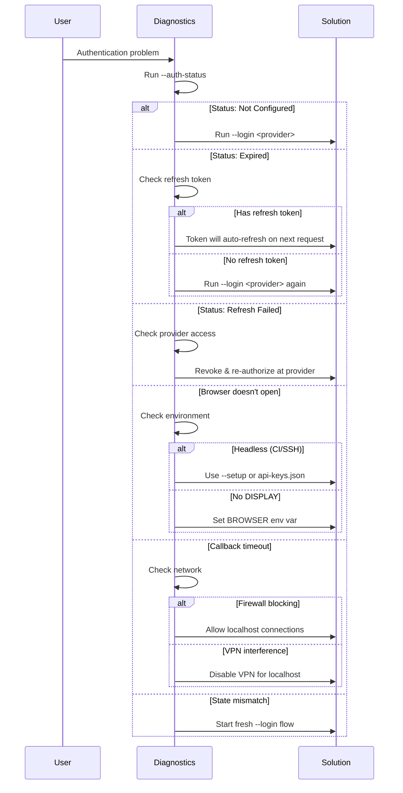

# OAuth Troubleshooting Guide

Common issues and solutions for OAuth 2.1 authentication in Registry Launcher.

## Diagnostic Flow



## Quick Diagnostics

```bash
# Check authentication status
node ./launch/index.js acp-registry --auth-status

# View logs (all output goes to stderr)
node ./launch/index.js acp-registry --auth-status 2>&1 | head -50
```

## Common Issues

### Browser Doesn't Open

**Symptoms:**
- `--login` command hangs without opening browser
- "Opening browser for authentication..." message appears but nothing happens

**Causes & Solutions:**

| Cause | Solution |
|-------|----------|
| Headless/CI environment | Use `--setup` for manual credential entry |
| SSH session without X11 | Forward X11 or use manual setup |
| No default browser set | Set `BROWSER` environment variable |
| WSL without browser access | Configure WSL browser integration |

**Detection:**
```bash
# Check if running in headless mode
echo $CI $SSH_TTY $DISPLAY
```

### Callback Timeout

**Symptoms:**
- "Authentication timed out" error after 5 minutes
- Browser shows success but CLI reports failure

**Causes & Solutions:**

| Cause | Solution |
|-------|----------|
| Firewall blocking localhost | Allow connections to 127.0.0.1 |
| Port conflict | Retry (uses dynamic port allocation) |
| Browser cached old redirect | Clear browser cache, retry |
| VPN/proxy interference | Disable VPN for localhost traffic |

### Invalid State Parameter

**Symptoms:**
- "State parameter mismatch" error
- Authentication fails after browser redirect

**Causes & Solutions:**

| Cause | Solution |
|-------|----------|
| Multiple login attempts | Complete one flow before starting another |
| Browser back button used | Start fresh login flow |
| Session expired | Retry login within 5 minutes |

### Token Refresh Failures

**Symptoms:**
- "Token refresh failed" in logs
- Requests fail after working initially

**Causes & Solutions:**

| Cause | Solution |
|-------|----------|
| Refresh token expired | Re-authenticate with `--login` |
| Provider revoked access | Re-authorize in provider dashboard |
| Network issues | Check connectivity to provider |

### AUTH_REQUIRED Errors

**Symptoms:**
- JSON-RPC error with code `-32001` (AUTH_REQUIRED)
- Agent requests fail with authentication error

**Causes & Solutions:**

| Cause | Solution |
|-------|----------|
| No credentials stored | Run `--login <provider>` |
| Wrong provider | Check agent's required auth method |
| Expired credentials | Re-authenticate |
| `AUTH_AUTO_OAUTH=false` | Set to `true` or login manually first |

## Provider-Specific Issues

### OpenAI

**Issue:** "Invalid client_id"
- Verify OAuth app is registered at platform.openai.com
- Check client_id matches registered app

**Issue:** "Scope not allowed"
- Request only `openid` and `profile` scopes
- Additional scopes require app approval

### GitHub

**Issue:** "Application suspended"
- Check GitHub OAuth app status in developer settings
- Verify app hasn't exceeded rate limits

**Issue:** "Redirect URI mismatch"
- Add `http://127.0.0.1` to allowed redirect URIs
- Don't include port number in GitHub settings

### Google

**Issue:** "Access blocked: App not verified"
- For development: click "Advanced" → "Go to app"
- For production: complete Google verification process

**Issue:** "Invalid redirect_uri"
- Add `http://127.0.0.1` to authorized redirect URIs
- Include all port variations if needed

### Azure AD

**Issue:** "AADSTS50011: Reply URL mismatch"
- Add `http://127.0.0.1` to redirect URIs in Azure portal
- Check tenant ID is correct

**Issue:** "AADSTS700016: Application not found"
- Verify application (client) ID
- Check app is registered in correct tenant

### AWS Cognito

**Issue:** "Invalid redirect_uri"
- Add callback URL to Cognito app client settings
- Verify user pool domain is correct

**Issue:** "User pool client does not exist"
- Check client_id matches Cognito app client
- Verify region is correct

## CLI Exit Codes

| Code | Meaning | Action |
|------|---------|--------|
| 0 | Success | None |
| 1 | General error | Check error message |
| 2 | Invalid arguments | Check command syntax |
| 3 | Authentication failed | Retry or check credentials |
| 4 | Timeout | Retry, check network |
| 5 | Provider error | Check provider status |

## Storage Issues

### Keychain Access Denied

**macOS:**
```bash
# Grant keychain access
security unlock-keychain ~/Library/Keychains/login.keychain-db
```

**Linux (libsecret):**
```bash
# Check secret service is running
systemctl --user status gnome-keyring-daemon
```

**Windows:**
```powershell
# Check Credential Manager
cmdkey /list
```

### Encrypted File Storage

**Location:** `~/.config/registry-launcher/credentials.enc`

**Reset credentials:**
```bash
# Remove encrypted file (will require re-authentication)
rm ~/.config/registry-launcher/credentials.enc
```

## Debugging

### Enable Verbose Logging

```bash
# Set debug environment variable
DEBUG=auth:* node ./launch/index.js acp-registry --login openai 2>&1
```

### Inspect Stored Credentials

```bash
# Check auth status (shows providers, not tokens)
node ./launch/index.js acp-registry --auth-status
```

### Test Token Validity

```bash
# Send test request to verify authentication
echo '{"jsonrpc":"2.0","id":"1","method":"initialize","params":{"agentId":"claude-acp","clientInfo":{"name":"test"}}}' | \
  node ./launch/index.js acp-registry 2>/dev/null
```

## CI/CD Environments

### GitHub Actions

```yaml
# OAuth not available in CI - use API keys
env:
  ANTHROPIC_API_KEY: ${{ secrets.ANTHROPIC_API_KEY }}
  OPENAI_API_KEY: ${{ secrets.OPENAI_API_KEY }}
```

### Docker

```bash
# Mount api-keys.json for non-interactive auth
docker run -v $(pwd)/api-keys.json:/api-keys.json:ro ...
```

### Headless Servers

```bash
# Use --setup with manual input
echo "sk-..." | node ./launch/index.js acp-registry --setup
# Or use api-keys.json
```

## Migration Issues

### From api-keys.json to OAuth

1. OAuth credentials take precedence when available
2. api-keys.json continues to work as fallback
3. No migration required - both work simultaneously

### AUTH_AUTO_OAUTH Behavior

| Value | Behavior |
|-------|----------|
| `false` (default) | Only use OAuth if explicitly logged in via `--login` |
| `true` | Auto-trigger browser OAuth when agent requires it |

**Recommendation:** Keep `false` for production, use `true` for development.

## Getting Help

1. Check [User Guide](./user-guide.md) for basic usage
2. Review [Security Guide](./security.md) for security-related issues
3. Check [Technical Reference](./technical-reference.md) for architecture details
4. Open issue on [GitHub](https://github.com/stdiobus/workers-registry/issues)

## Error Reference

| Error Code | Message | Cause |
|------------|---------|-------|
| AUTH_REQUIRED | Authentication required | No valid credentials |
| INVALID_GRANT | Invalid authorization code | Code expired or already used |
| INVALID_CLIENT | Client authentication failed | Wrong client_id/secret |
| INVALID_SCOPE | Invalid scope | Requested scope not allowed |
| ACCESS_DENIED | User denied access | User cancelled in browser |
| SERVER_ERROR | Provider server error | Provider temporarily unavailable |
| TIMEOUT | Authentication timed out | Flow not completed in time |
| STATE_MISMATCH | State parameter mismatch | CSRF protection triggered |
| UNSUPPORTED_PROVIDER | Provider not supported | Unknown provider ID |
