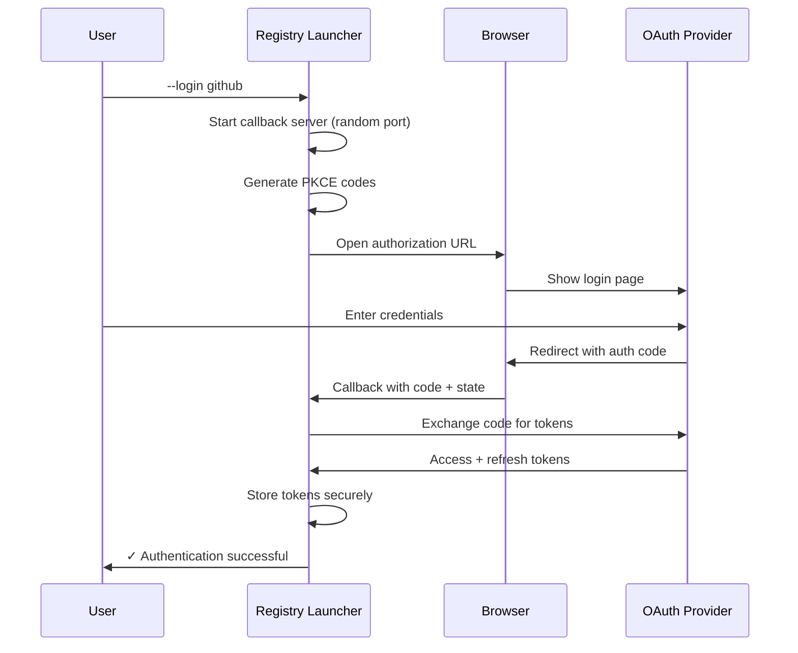
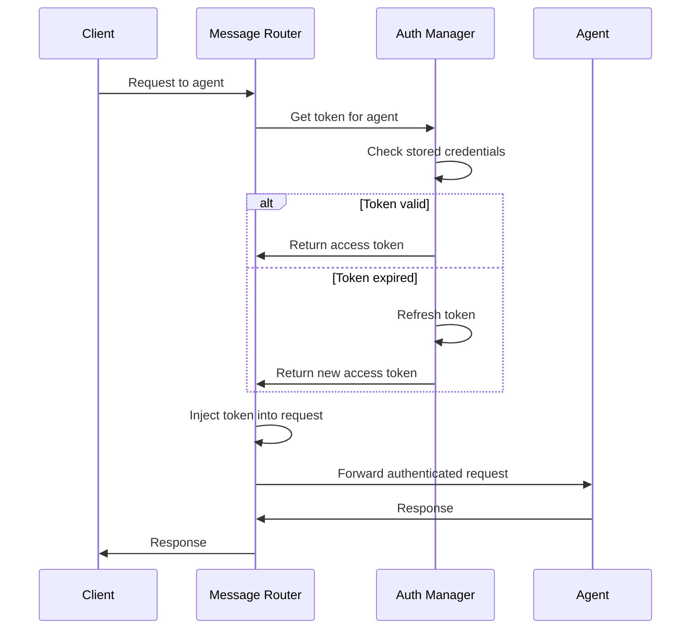
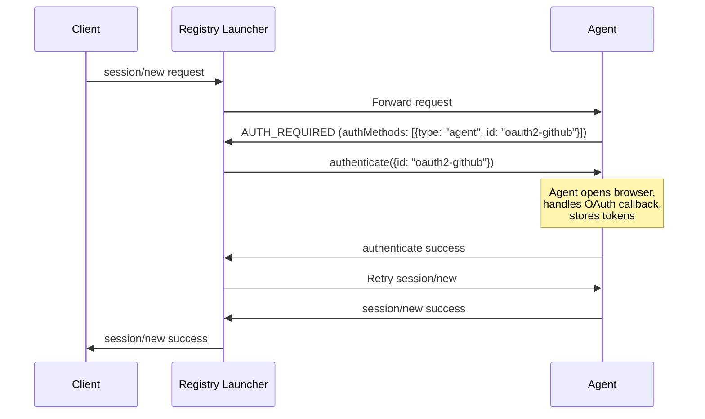
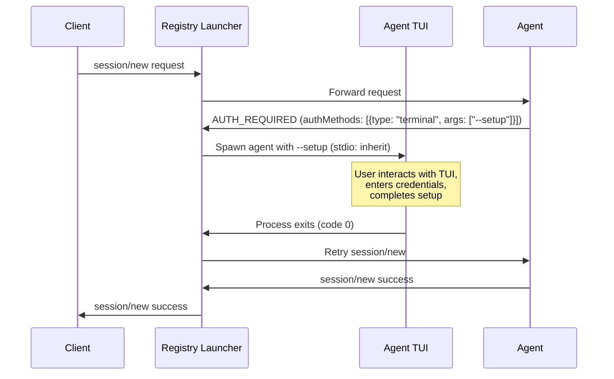

# OAuth 2.1 User Guide

This guide explains how to use OAuth 2.1 authentication with the Registry Launcher.

## Prerequisites

- Node.js 20.0.0 or later
- A web browser for OAuth authentication
- Client credentials from your OAuth provider (for some providers)

## Understanding Authentication Types

The Registry Launcher supports two distinct authentication mechanisms:

### OAuth Identity Providers (User Identity)

OAuth 2.1 / OpenID Connect providers authenticate **end users**:
- **GitHub** - OAuth profile
- **Google** - OpenID Connect
- **AWS Cognito** - Configurable user pool
- **Microsoft Entra ID** (formerly Azure AD) - Single/multi-tenant
- **Generic OIDC** - Any OIDC-compliant provider (Auth0, Okta, Keycloak, etc.)

### Model API Keys (Model Access)

API keys authenticate access to **AI model APIs**:
- **OpenAI** - Uses API keys (NOT OAuth)
- **Anthropic** - Uses API keys (NOT OAuth)

> **Important:** OpenAI and Anthropic do NOT offer public OAuth IdP for third-party login. They use API keys for authentication.

## Authentication Methods

### 1. Browser OAuth (Recommended for Identity Providers)

Browser-based OAuth 2.1 authentication with PKCE for maximum security.

```bash
# Login with GitHub
node ./launch/index.js acp-registry --login github

# Login with Google
node ./launch/index.js acp-registry --login google

# Login with AWS Cognito
node ./launch/index.js acp-registry --login cognito

# Login with Microsoft Entra ID
node ./launch/index.js acp-registry --login azure

# Login with Generic OIDC provider
node ./launch/index.js acp-registry --login oidc
```

> **Note:** `--login openai` and `--login anthropic` are NOT supported because these providers use API keys, not OAuth. Use `--setup` to configure API keys for OpenAI and Anthropic.

**What happens:**



**Steps:**
1. A local callback server starts on a random port
2. Your default browser opens to the provider's login page
3. After authentication, you're redirected back to the local server
4. Tokens are securely stored for future use

### 2. Interactive Setup Wizard

The setup wizard guides you through authentication for multiple providers.

```bash
node ./launch/index.js acp-registry --setup
```

**Features:**
- Select OAuth providers to configure (GitHub, Google, Cognito, Azure, OIDC)
- Configure Model API Keys (OpenAI, Anthropic)
- Choose between Browser OAuth or Manual configuration
- Validate credentials before storing
- View current authentication status

### 3. Model API Keys (OpenAI, Anthropic)

OpenAI and Anthropic do NOT offer public OAuth IdP for third-party login. Instead, they use API keys for authentication.

**Configure via Setup Wizard:**
```bash
node ./launch/index.js acp-registry --setup
# Select "Model API Keys" section
# Enter your OpenAI or Anthropic API key
```

**Configure via api-keys.json:**
```json
{
  "claude-acp": {
    "apiKey": "sk-ant-api03-...",
    "env": {
      "ANTHROPIC_API_KEY": "sk-ant-api03-..."
    }
  },
  "openai-agent": {
    "apiKey": "sk-proj-...",
    "env": {
      "OPENAI_API_KEY": "sk-proj-..."
    }
  }
}
```

**Header Injection:**
- **OpenAI**: `Authorization: Bearer {key}`
- **Anthropic**: `x-api-key: {key}`

## Generic OIDC Provider

The Generic OIDC provider supports any OpenID Connect-compliant identity provider, including:
- Auth0
- Okta
- Keycloak
- PingIdentity
- Custom enterprise IdPs

### OIDC Discovery

The provider uses OIDC Discovery to automatically configure endpoints:

```bash
node ./launch/index.js acp-registry --login oidc
# You will be prompted for:
# - Issuer URL (e.g., https://your-tenant.auth0.com)
# - Client ID
# - Client Secret (optional)
```

The provider fetches `/.well-known/openid-configuration` from the issuer URL to discover:
- Authorization endpoint
- Token endpoint
- JWKS URI for token validation

### Manual Endpoint Override

If OIDC Discovery is unavailable, you can manually configure endpoints via `--setup`:

```bash
node ./launch/index.js acp-registry --setup
# Select "Generic OIDC"
# Choose "Manual configuration"
# Enter authorization_endpoint, token_endpoint, etc.
```

## Checking Authentication Status

View the current authentication status for all providers:

```bash
node ./launch/index.js acp-registry --auth-status
```

**Example output:**
```
=== OAuth Authentication Status ===

  GitHub:
    Status: ✓ Authenticated
    Expires at: 3/26/2026, 10:30:00 AM
    Scope: read:user
    Last Updated: 3/25/2026, 9:30:00 AM

  Google:
    Status: ○ Not Configured

  Cognito:
    Status: ○ Not Configured

  Azure (Microsoft Entra ID):
    Status: ○ Not Configured

  OIDC:
    Status: ○ Not Configured

=== Model API Keys ===

  OpenAI:
    Status: ✓ Configured
    Last Updated: 3/25/2026, 9:00:00 AM

  Anthropic:
    Status: ⚠ Not Configured

--- Summary ---
  OAuth Authenticated: 1
  OAuth Expired/Failed: 0
  OAuth Not Configured: 4
  Model Keys Configured: 1
  Model Keys Not Configured: 1
```

## Logging Out

### Logout from all providers

```bash
node ./launch/index.js acp-registry --logout
```

### Logout from specific provider

```bash
node ./launch/index.js acp-registry --logout github
```

## Using Authenticated Agents

Once authenticated, the Registry Launcher automatically injects credentials into agent requests.



### Example: Using Claude with API Key

```bash
# 1. Configure Anthropic API key
node ./launch/index.js acp-registry --setup
# Select "Model API Keys" → "Anthropic"
# Enter your API key

# 2. Start the Registry Launcher
docker run -p 9000:9000 \
  -v $(pwd)/config.json:/config.json:ro \
  stdiobus/stdiobus:latest \
  --config /config.json --tcp 0.0.0.0:9000

# 3. Send requests (authentication is automatic)
echo '{"jsonrpc":"2.0","id":"1","method":"initialize","params":{"agentId":"claude-acp"}}' | nc localhost 9000
```

## Credential Precedence

When multiple credential sources are available, the Registry Launcher uses this precedence:

1. **OAuth tokens** (highest priority) - From `--login` or `--setup`
2. **Model API keys** - From `--setup` or `api-keys.json`
3. **Environment variables** - Provider-specific env vars

## Headless Environments

In headless environments (CI, SSH, Docker), browser OAuth is not available:

```bash
# This will show an error in headless mode
node ./launch/index.js acp-registry --login github
# Error: Browser OAuth not available in headless environment
# Suggestion: Use --setup for manual credential configuration
```

**Solutions:**
1. Use `api-keys.json` for API key authentication
2. Run `--login` on a machine with a browser, then copy credentials
3. Use environment variables for provider-specific API keys

## Token Storage

Tokens are stored securely using one of these backends:

1. **OS Keychain** (preferred) - macOS Keychain, Windows Credential Manager, Linux Secret Service
2. **Encrypted File** (fallback) - AES-256-GCM encrypted file in user config directory

The storage backend is selected automatically based on availability.

## Token Refresh

Tokens are automatically refreshed:
- **Proactive refresh**: 5 minutes before expiration
- **On-demand refresh**: When a request is made with an expired token
- **Refresh token rotation**: New refresh tokens are stored automatically

## Troubleshooting

### Browser doesn't open

```bash
# Check if you're in a headless environment
echo $SSH_TTY  # If set, you're in SSH
echo $CI       # If set, you're in CI
```

### Authentication timeout

The default timeout is 5 minutes. If authentication takes longer:
1. Check your browser for the login page
2. Ensure you're logged into the provider
3. Try again with `--login`

### Token refresh fails

```bash
# Check status
node ./launch/index.js acp-registry --auth-status

# Re-authenticate if needed
node ./launch/index.js acp-registry --login <provider>
```

### Keychain access denied

On macOS, you may need to allow keychain access:
1. Open Keychain Access
2. Find "stdio-bus-oauth" entries
3. Allow access for your terminal application


## ACP Auth Flows (Registry Launcher)

The Registry Launcher supports two ACP-compliant authentication methods that agents can advertise in their `authMethods` array during initialization:

| Type | Description | Who Handles OAuth |
|------|-------------|-------------------|
| `agent` (default) | Agent handles OAuth internally | Agent |
| `terminal` | Client spawns agent for interactive TUI setup | Agent (via TUI) |

### Method Selection Precedence

When an agent returns `AUTH_REQUIRED`, the Registry Launcher selects an auth method in this order:

1. **Agent Auth** (`type: "agent"` or no type) - Preferred when available
2. **Terminal Auth** (`type: "terminal"`) - Used when TTY is available
3. **OAuth** (legacy browser flow) - Launcher-managed OAuth
4. **API Key** - From `api-keys.json` or environment variables

---

## Agent Auth (type: "agent")

Agent Auth delegates the entire OAuth flow to the agent. The agent handles browser launch, callback server, and token storage internally.

### Flow Diagram



### JSON-RPC Example

When the agent returns `AUTH_REQUIRED`:

```json
{
  "jsonrpc": "2.0",
  "id": "1",
  "error": {
    "code": -32001,
    "message": "Authentication required",
    "data": {
      "authMethods": [
        {
          "type": "agent",
          "id": "oauth2-github",
          "name": "GitHub OAuth"
        }
      ]
    }
  }
}
```

The Registry Launcher calls the `authenticate` method:

```json
{
  "jsonrpc": "2.0",
  "id": "auth-1",
  "method": "authenticate",
  "params": {
    "id": "oauth2-github"
  }
}
```

### Responsibilities

| Component | Responsibility |
|-----------|----------------|
| Registry Launcher | Detect AUTH_REQUIRED, call `authenticate`, queue requests, retry on success |
| Agent | Start callback server, open browser, handle OAuth, store tokens, return success/error |

### Behavior Notes

- **Request Queueing**: While authentication is pending, subsequent requests are queued
- **Timeout**: Default 10 minutes for the authenticate call
- **Retry**: On success, the original request is automatically retried
- **Error Propagation**: On failure, the error is returned to the client

---

## Terminal Auth (type: "terminal")

Terminal Auth spawns the agent binary with special arguments for interactive TUI-based authentication setup.

### Flow Diagram



### JSON-RPC Example

When the agent returns `AUTH_REQUIRED` with Terminal Auth:

```json
{
  "jsonrpc": "2.0",
  "id": "1",
  "error": {
    "code": -32001,
    "message": "Authentication required",
    "data": {
      "authMethods": [
        {
          "type": "terminal",
          "id": "setup-wizard",
          "name": "Interactive Setup",
          "args": ["--setup"],
          "env": {
            "AGENT_SETUP_MODE": "true"
          }
        }
      ]
    }
  }
}
```

### How It Works

1. **Spawn**: Registry Launcher spawns the same agent binary with:
   - Arguments from `args` array (e.g., `["--setup"]`)
   - Environment variables from `env` object merged with `process.env`
   - `stdio: 'inherit'` for interactive terminal access

2. **User Interaction**: The agent's TUI guides the user through authentication

3. **Completion**: When the process exits with code 0, the original request is retried

### TTY Requirements

Terminal Auth requires an interactive terminal:

- **stdin** must be a TTY
- **stdout** must be a TTY

In headless environments (CI, SSH without TTY, Docker), Terminal Auth is skipped and the next available method is tried.

### Configuration Example

Agent advertises Terminal Auth in its initialize response:

```json
{
  "authMethods": [
    {
      "type": "terminal",
      "id": "cli-setup",
      "name": "CLI Setup Wizard",
      "args": ["--setup", "--interactive"],
      "env": {
        "SETUP_MODE": "oauth"
      }
    }
  ]
}
```

---

## ACP Auth Troubleshooting

### Agent Auth Issues

**authenticate timeout**
- Default timeout is 10 minutes
- Check if the agent's browser opened
- Verify the OAuth provider is accessible
- Check agent logs for callback server errors

**Repeated AUTH_REQUIRED**
- Agent may not be storing tokens correctly
- Check agent's credential storage
- Verify the agent's OAuth configuration

**authenticate returns error**
- Check the error message for details
- Common causes: invalid client_id, network issues, user cancelled

### Terminal Auth Issues

**"Terminal Auth not available"**
- Running in headless environment (no TTY)
- Try running from an interactive terminal
- Use Agent Auth or API key as alternative

**Non-zero exit code**
- The setup process failed
- Check agent's stderr output for errors
- Run the setup command manually to debug

**Setup succeeded but still AUTH_REQUIRED**
- Agent may store credentials in a different location
- Verify the agent can read its stored credentials
- Check file permissions on credential storage

---

## Security Notes

### Token Handling

- **Agent Auth**: Tokens are managed entirely by the agent
- **Terminal Auth**: Credentials are stored by the agent's setup process
- **Registry Launcher**: Does not store tokens for Agent/Terminal Auth flows

### Log Redaction

- Access tokens are never logged
- Refresh tokens are never logged
- Only token metadata (expiry, scope) may appear in debug logs

### Credential Storage Ownership

| Auth Type | Storage Owner | Location |
|-----------|---------------|----------|
| Agent Auth | Agent | Agent-specific |
| Terminal Auth | Agent | Agent-specific |
| OAuth (legacy) | Registry Launcher | OS Keychain or encrypted file |
| Model API Key | User | `api-keys.json` or Credential Store |

---

## Supported Providers Summary

### OAuth Identity Providers (User Identity)

| Provider | Endpoints | Default Scopes | Token Injection |
|----------|-----------|----------------|-----------------|
| GitHub | github.com/login/oauth/* | read:user | Bearer header |
| Google | accounts.google.com/* | openid, profile, email | Bearer header |
| AWS Cognito | {userPoolDomain}/oauth2/* | openid, profile | Bearer header |
| Microsoft Entra ID | login.microsoftonline.com/{tenant}/* | openid, profile | Bearer header |
| Generic OIDC | {issuer}/.well-known/openid-configuration | openid, profile | Bearer header |

### Model API Keys (Model Access)

| Provider | Authentication Method | Header |
|----------|----------------------|--------|
| OpenAI | API Key | `Authorization: Bearer {key}` |
| Anthropic | API Key | `x-api-key: {key}` |

> **Note:** OpenAI and Anthropic do NOT offer public OAuth IdP for third-party login. Use API keys for authentication.

---

## Next Steps

- [Configuration](./configuration.md) - Environment variables and settings
- [CLI Reference](./cli-reference.md) - Complete command reference
- [Security](./security.md) - Security best practices
