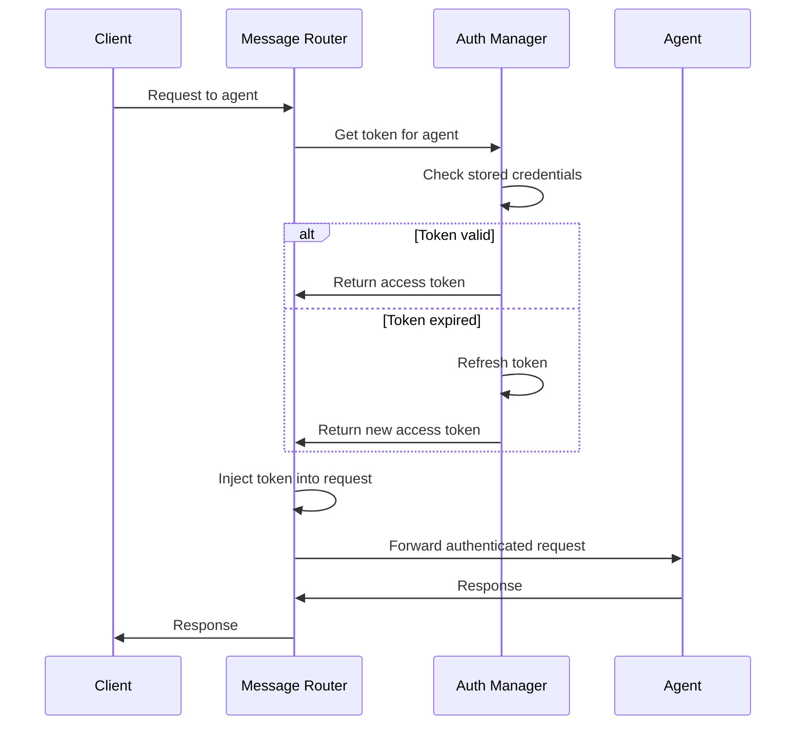

# OAuth 2.1 User Guide

This guide explains how to use OAuth 2.1 authentication with the Registry Launcher.

## Prerequisites

- Node.js 20.0.0 or later
- A web browser for OAuth authentication
- Client credentials from your OAuth provider (for some providers)

## Authentication Methods

### 1. Browser OAuth (Recommended)

Browser-based OAuth 2.1 authentication with PKCE for maximum security.

```bash
# Login with OpenAI
node ./launch/index.js acp-registry --login openai

# Login with GitHub
node ./launch/index.js acp-registry --login github

# Login with Google
node ./launch/index.js acp-registry --login google
```

**What happens:**


**Steps:**
1. A local callback server starts on a random port
2. Your default browser opens to the provider's login page
3. After authentication, you're redirected back to the local server
4. Tokens are securely stored for future use

### 2. Interactive Setup Wizard

The setup wizard guides you through authentication for multiple providers.

```bash
node ./launch/index.js acp-registry --setup
```

**Features:**
- Select providers to configure
- Choose between Browser OAuth or Manual API Key
- Validate credentials before storing
- View current authentication status

### 3. Manual API Key (Legacy)

For environments where browser OAuth isn't available, use `api-keys.json`:

```json
{
  "claude-acp": {
    "apiKey": "sk-ant-api03-...",
    "env": {
      "ANTHROPIC_API_KEY": "sk-ant-api03-..."
    }
  },
  "openai-agent": {
    "apiKey": "sk-proj-...",
    "env": {
      "OPENAI_API_KEY": "sk-proj-..."
    }
  }
}
```

## Checking Authentication Status

View the current authentication status for all providers:

```bash
node ./launch/index.js acp-registry --auth-status
```

**Example output:**
```
=== OAuth Authentication Status ===

  Openai:
    Status: ✓ Authenticated
    Expires at: 3/26/2026, 10:30:00 AM
    Scope: openid profile
    Last Updated: 3/25/2026, 9:30:00 AM

  Github:
    Status: ○ Not Configured

  Anthropic:
    Status: ⚠ Expired (refresh available)
    Expired at: 3/24/2026, 5:00:00 PM

--- Summary ---
  Authenticated: 1
  Expired/Failed: 1
  Not Configured: 4
```

## Logging Out

### Logout from all providers

```bash
node ./launch/index.js acp-registry --logout
```

### Logout from specific provider

```bash
node ./launch/index.js acp-registry --logout openai
```

## Using Authenticated Agents

Once authenticated, the Registry Launcher automatically injects credentials into agent requests.



### Example: Using Claude with OAuth

```bash
# 1. Login with Anthropic
node ./launch/index.js acp-registry --login anthropic

# 2. Start the Registry Launcher
docker run -p 9000:9000 \
  -v $(pwd)/config.json:/config.json:ro \
  stdiobus/stdiobus:latest \
  --config /config.json --tcp 0.0.0.0:9000

# 3. Send requests (authentication is automatic)
echo '{"jsonrpc":"2.0","id":"1","method":"initialize","params":{"agentId":"claude-acp"}}' | nc localhost 9000
```

## Credential Precedence

When multiple credential sources are available, the Registry Launcher uses this precedence:

1. **OAuth tokens** (highest priority) - From `--login` or `--setup`
2. **API keys from api-keys.json** - Legacy configuration
3. **Environment variables** - Provider-specific env vars

## Headless Environments

In headless environments (CI, SSH, Docker), browser OAuth is not available:

```bash
# This will show an error in headless mode
node ./launch/index.js acp-registry --login openai
# Error: Browser OAuth not available in headless environment
# Suggestion: Use --setup for manual credential configuration
```

**Solutions:**
1. Use `api-keys.json` for API key authentication
2. Run `--login` on a machine with a browser, then copy credentials
3. Use environment variables for provider-specific API keys

## Token Storage

Tokens are stored securely using one of these backends:

1. **OS Keychain** (preferred) - macOS Keychain, Windows Credential Manager, Linux Secret Service
2. **Encrypted File** (fallback) - AES-256-GCM encrypted file in user config directory

The storage backend is selected automatically based on availability.

## Token Refresh

Tokens are automatically refreshed:
- **Proactive refresh**: 5 minutes before expiration
- **On-demand refresh**: When a request is made with an expired token
- **Refresh token rotation**: New refresh tokens are stored automatically

## Troubleshooting

### Browser doesn't open

```bash
# Check if you're in a headless environment
echo $SSH_TTY  # If set, you're in SSH
echo $CI       # If set, you're in CI
```

### Authentication timeout

The default timeout is 5 minutes. If authentication takes longer:
1. Check your browser for the login page
2. Ensure you're logged into the provider
3. Try again with `--login`

### Token refresh fails

```bash
# Check status
node ./launch/index.js acp-registry --auth-status

# Re-authenticate if needed
node ./launch/index.js acp-registry --login <provider>
```

### Keychain access denied

On macOS, you may need to allow keychain access:
1. Open Keychain Access
2. Find "stdio-bus-oauth" entries
3. Allow access for your terminal application

## Next Steps

- [Configuration](./configuration.md) - Environment variables and settings
- [CLI Reference](./cli-reference.md) - Complete command reference
- [Security](./security.md) - Security best practices
