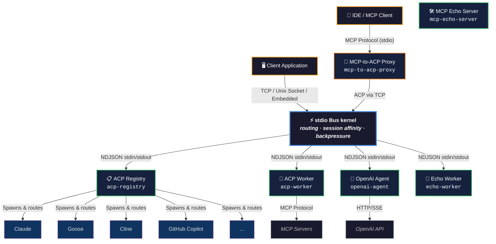

# stdio Bus – Workers Registry

[](https://www.npmjs.com/package/@stdiobus/workers-registry)
[](https://www.npmjs.com/package/@stdiobus/workers-registry)
[](https://agentclientprotocol.com)
[](https://modelcontextprotocol.io)
[](https://github.com/stdiobus)
[](https://nodejs.org)
[](https://www.typescriptlang.org)
[](https://github.com/stdiobus/workers-registry)
[](https://github.com/stdiobus/workers-registry)
[](https://github.com/stdiobus/workers-registry/blob/main/LICENSE)

Protocol workers for [stdio Bus](https://github.com/stdiobus/stdiobus) — a high-performance message routing kernel for AI agent protocols. This package provides ready-to-use ACP and MCP workers that run as child processes, communicating via NDJSON over stdin/stdout.

---

## Install

```bash
npm install @stdiobus/workers-registry
```

For embedded mode (no Docker or binary needed):

```bash
npm install @stdiobus/node @stdiobus/workers-registry
```

Requires **Node.js ≥ 20.0.0**.

---

## Architecture



Workers communicate with the kernel via **NDJSON** (JSON-RPC 2.0, one message per line) over stdin/stdout. All logging goes to stderr. The kernel handles routing, session affinity, backpressure, and worker lifecycle.

---

## Quick Start

### Embedded

No Docker, no binary, no TCP. The bus runs inside your Node.js process.

```javascript
import { StdioBus } from '@stdiobus/node';

const bus = new StdioBus({
  config: {
    pools: [{
      id: 'openai-agent',
      command: 'npx',
      args: ['@stdiobus/workers-registry', 'openai-agent'],
      instances: 1,
    }],
  },
});

await bus.start();

const result = await bus.request('initialize', {
  protocolVersion: 1,
  clientInfo: { name: 'my-app', version: '1.0.0' },
});

console.log(result.agentInfo.name); // 'openai-agent'
await bus.stop();
```

### Universal Launcher

Run any worker directly:

```bash
npx @stdiobus/workers-registry echo-worker
npx @stdiobus/workers-registry acp-registry
npx @stdiobus/workers-registry openai-agent
```

### Docker / TCP Mode

```bash
docker run -p 9000:9000 \
  -v $(pwd)/config.json:/config.json:ro \
  stdiobus/stdiobus:latest \
  --config /config.json --tcp 0.0.0.0:9000
```

```bash
echo '{"jsonrpc":"2.0","id":"1","method":"initialize","params":{"clientInfo":{"name":"test","version":"1.0"}}}' \
  | nc localhost 9000
```

---

## Workers

### Launchable Workers

| Worker | Description | Protocol |
|--------|-------------|----------|
| `acp-registry` | Routes to any [ACP Registry](https://agentclientprotocol.com) agent (Claude, Goose, Cline, Copilot, etc.) | ACP |
| `acp-worker` | Standalone ACP agent for SDK/protocol testing | ACP |
| `openai-agent` | Bridges ACP to any OpenAI-compatible Chat Completions endpoint | ACP |
| `mcp-to-acp-proxy` | Bridges MCP clients (IDEs) to ACP agents via stdio Bus | MCP → ACP |
| `echo-worker` | Echoes messages back — for testing and protocol learning | NDJSON |
| `mcp-echo-server` | MCP server with echo/reverse/uppercase tools — for testing | MCP |

All launchable via: `npx @stdiobus/workers-registry <worker-name>`

### Internal Modules

| Module | Description | Used by |
|--------|-------------|---------|
| `registry-launcher` | Agent discovery, routing, OAuth, runtime management | `acp-registry` |

Exported for programmatic use but not a direct launch target.

---

## Configuration

Workers are configured via stdio Bus pool configs:

```json
{
  "pools": [
    {
      "id": "acp-registry",
      "command": "npx",
      "args": ["@stdiobus/workers-registry", "acp-registry"],
      "instances": 1
    }
  ]
}
```

Swap `"acp-registry"` for any worker name. Scale with `"instances": N`.

### Worker-Specific Configuration

| Worker | Requirements |
|--------|-------------|
| `acp-registry` | `api-keys.json` in working directory (or custom config with `apiKeysPath`) |
| `openai-agent` | `OPENAI_API_KEY` env var or OAuth login |
| `mcp-to-acp-proxy` | `ACP_HOST`, `ACP_PORT`, `AGENT_ID` env vars |

### Limits (optional)

```json
{
  "limits": {
    "max_input_buffer": 1048576,
    "max_output_queue": 4194304,
    "max_restarts": 5,
    "restart_window_sec": 60,
    "drain_timeout_sec": 30,
    "backpressure_timeout_sec": 60
  }
}
```

See [stdio Bus documentation](https://stdiobus.com) for full configuration reference.

---

## Package API

### Exports

```javascript
// Default export — ACP Worker
import worker from '@stdiobus/workers-registry';

// Individual workers
import acpWorker from '@stdiobus/workers-registry/workers/acp-worker';
import openaiAgent from '@stdiobus/workers-registry/workers/openai-agent';
import echoWorker from '@stdiobus/workers-registry/workers/echo-worker';
import mcpEchoServer from '@stdiobus/workers-registry/workers/mcp-echo-server';
import mcpToAcpProxy from '@stdiobus/workers-registry/workers/mcp-to-acp-proxy';

// Registry Launcher (programmatic access)
import registryLauncher from '@stdiobus/workers-registry/workers/registry-launcher';
import { resolveRegistry } from '@stdiobus/workers-registry/workers/registry-launcher/registry';
import { RuntimeManager } from '@stdiobus/workers-registry/workers/registry-launcher/runtime';

// Workers metadata
import { workers } from '@stdiobus/workers-registry/workers';
```

### TypeScript

Full type definitions included. Strict mode.

```typescript
import type { ACPAgent } from '@stdiobus/workers-registry/workers/acp-worker';
import type { MCPServer } from '@stdiobus/workers-registry/workers/mcp-echo-server';
```

---

## IDE Integration (MCP Client)

Connect your IDE to ACP agents via the MCP-to-ACP proxy:

```json
{
  "mcpServers": {
    "stdio-bus-acp": {
      "command": "npx",
      "args": ["@stdiobus/workers-registry", "mcp-to-acp-proxy"],
      "env": {
        "ACP_HOST": "localhost",
        "ACP_PORT": "9000",
        "AGENT_ID": "claude-acp"
      }
    }
  }
}
```

Requires `acp-registry` running on the stdio Bus side to resolve `AGENT_ID` to real agents.

---

## Authentication

Registry Launcher supports two authentication methods:

### API Keys

Create `api-keys.json` in your working directory:

```json
{
  "claude-acp": { "apiKey": "sk-ant-..." },
  "openai-agent": { "apiKey": "sk-..." }
}
```

### OAuth 2.1 with PKCE

```bash
npx @stdiobus/workers-registry acp-registry --login openai
npx @stdiobus/workers-registry acp-registry --auth-status
npx @stdiobus/workers-registry acp-registry --logout
```

Supported providers: OpenAI, Anthropic, GitHub, Google, Azure AD, AWS Cognito.

OAuth takes precedence when available, with automatic fallback to API keys. For headless/CI environments, use API keys or environment variables.

See [OAuth documentation](docs/oauth/user-guide.md) for details.

---

## Deployment Modes

| Mode | Package | Infrastructure | Use case |
|------|---------|---------------|----------|
| **Embedded** | `@stdiobus/node` + this package | None | Applications, scripts, testing |
| **Docker** | This package (mounted) | `stdiobus/stdiobus` container | Production, multi-worker setups |
| **Binary** | This package (on disk) | `stdio_bus` binary | Custom deployments |

All modes use the same worker configs and the same `npx @stdiobus/workers-registry <worker>` command.

---

## Troubleshooting

| Problem | Solution |
|---------|----------|
| `node: command not found` or version < 20 | Install Node.js ≥ 20 (`nvm install 20`) |
| Worker crashes on start | Check stderr output; verify config JSON is valid |
| `acp-registry` fails to route | Ensure `api-keys.json` exists with valid keys |
| Connection refused on port 9000 | Verify stdio Bus kernel is running (`docker ps`) |
| MCP proxy can't reach agent | Check `ACP_HOST`/`ACP_PORT` env vars point to running kernel |

---

## Documentation

- [stdio Bus kernel](https://github.com/stdiobus/stdiobus) — Core daemon (source code)
- [`@stdiobus/node`](https://www.npmjs.com/package/@stdiobus/node) — Embedded Node.js binding
- [stdio Bus on Docker Hub](https://hub.docker.com/r/stdiobus/stdiobus) — Docker images
- [Full documentation](https://stdiobus.com) — Protocol reference, guides, examples
- [OAuth User Guide](docs/oauth/user-guide.md) — Authentication setup
- [OAuth CLI Reference](docs/oauth/cli-reference.md) — CLI commands
- [FAQ](docs/FAQ.md) — Frequently asked questions

---

## Contributing

```bash
git clone https://github.com/stdiobus/workers-registry
cd workers-registry
npm install
npm run build
npm test
```

See [CONTRIBUTING.md](sandbox/CONTRIBUTING.md) for guidelines.

---

## License

Apache License 2.0 — Copyright (c) 2025–present Raman Marozau, [Target Insight Function](https://worktif.com).

See [LICENSE](LICENSE) for details.
